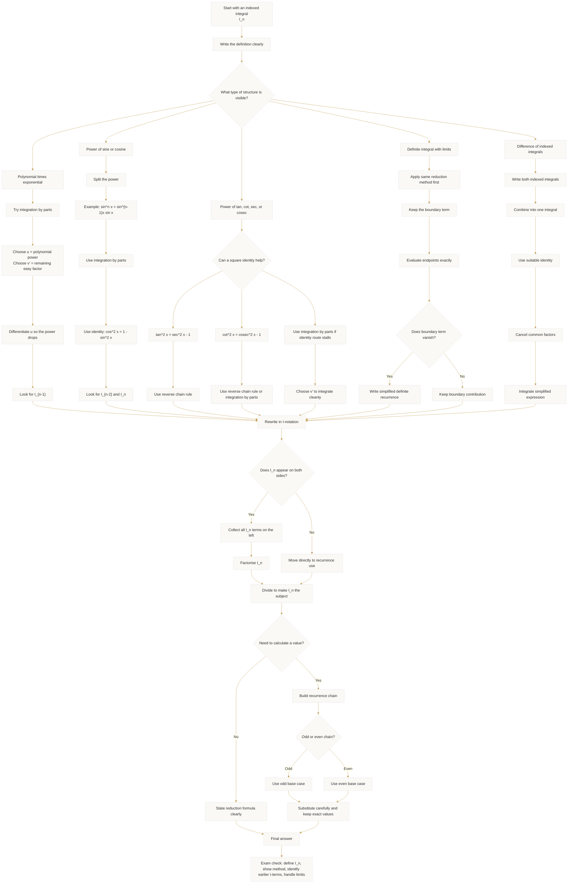

# Mermaid Asset: FA21IntegrationTechniquesMermaid-001

## Asset Metadata

| Field | Value |
|---|---|
| Asset ID | `FA21IntegrationTechniquesMermaid-001` |
| Unit | `FA21` Further A2 1 Pure Mathematics |
| Topic code | `FA21-FCALC` |
| Topic ID | `FA21IntegrationTechniques` |
| Related lesson file | `FA21_integration_techniques_lesson.md` |
| Related lesson section | `# 9. Visual Asset Integration` |
| Used placeholder | `[VISUAL PLACEHOLDER: FA21IntegrationTechniquesMermaid-001 | Source: CCEA Further Mathematics specification boundary + transcript reduction formula examples | Insert from mermaid/FA21IntegrationTechniquesMermaid-001.md | Purpose: Show the decision process for choosing between integration by parts, trig identity reshaping, reverse chain rule, and recurrence substitution.]` |
| Source | CCEA Further Mathematics specification boundary + teacher transcript reduction formula examples |
| Evidence status | AI-generated Mermaid teaching visual based on on-spec reduction formula evidence |
| Purpose | Show the decision process for choosing between integration by parts, trig identity reshaping, reverse chain rule, and recurrence substitution. |

## Creation Notes

This diagram is a decision map for reduction formula questions. It keeps arc length and surface area outside the core flow because those topics were logged as boundary-risk in Phase 0 and Phase 1.

## Mermaid Code

