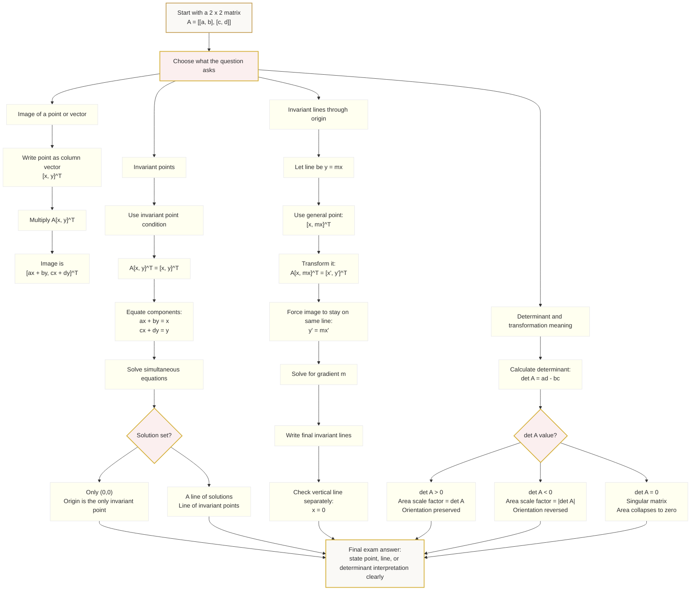

# Mermaid Asset: FAS1MatricesInvariantLinesMermaid-001

## Asset Metadata

| Field | Detail |
|---|---|
| Asset ID | `FAS1MatricesInvariantLinesMermaid-001` |
| Unit | `FAS1` |
| Topic Code | `FAS1-MAT` |
| Topic ID | `FAS1MatricesInvariantLines` |
| Lesson File | `FAS1_matrices_invariant_lines_lesson.md` |
| Related Lesson Section | `# 9. Visual Asset Integration` |
| Used Placeholder | `[VISUAL PLACEHOLDER: FAS1MatricesInvariantLinesMermaid-001 | Source: CCEA FAS1-MAT specification boundary | Insert from mermaid/FAS1MatricesInvariantLinesMermaid-001.md | Purpose: Show the decision flow from matrix transformation to invariant point, invariant line and determinant interpretation.]` |
| Source | CCEA FAS1-MAT specification boundary |
| Purpose | Show the decision flow from a matrix transformation to image point, invariant point, invariant line and determinant interpretation. |
| Core LO Links | `FAS1-MAT-LO003`, `FAS1-MAT-LO004`, `FAS1-MAT-LO006`, `FAS1-MAT-LO007`, `FAS1-MAT-LO008`, `FAS1-MAT-LO009`, `FAS1-MAT-LO010` |
| Off-Spec Control | Eigenvalues, eigenvectors and characteristic equations are deliberately excluded from this flowchart. |

## Creation Notes

This diagram is a navigation map for the CCEA-safe method used in the lesson.

## Mermaid Code

