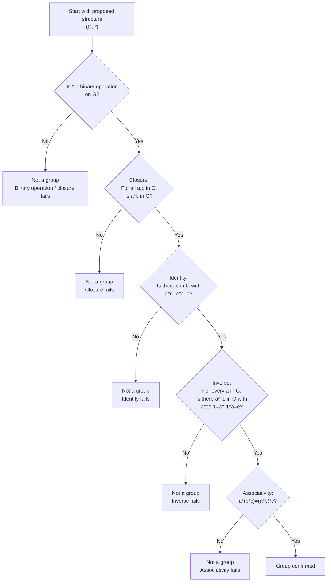

# Mermaid Asset: FAS2GroupTheoryMermaid-001

## Asset metadata

| Field | Value |
|---|---|
| Asset ID | `FAS2GroupTheoryMermaid-001` |
| Topic ID | `FAS2GroupTheory` |
| Related lesson file | `FAS2_group_theory_lesson.md` |
| Used placeholder | `FAS2GroupTheoryMermaid-001` |
| Source | CCEA FAS2-GROUP specification + transcript sections on group axioms |
| Purpose | Show the four group axioms as a decision process. |

