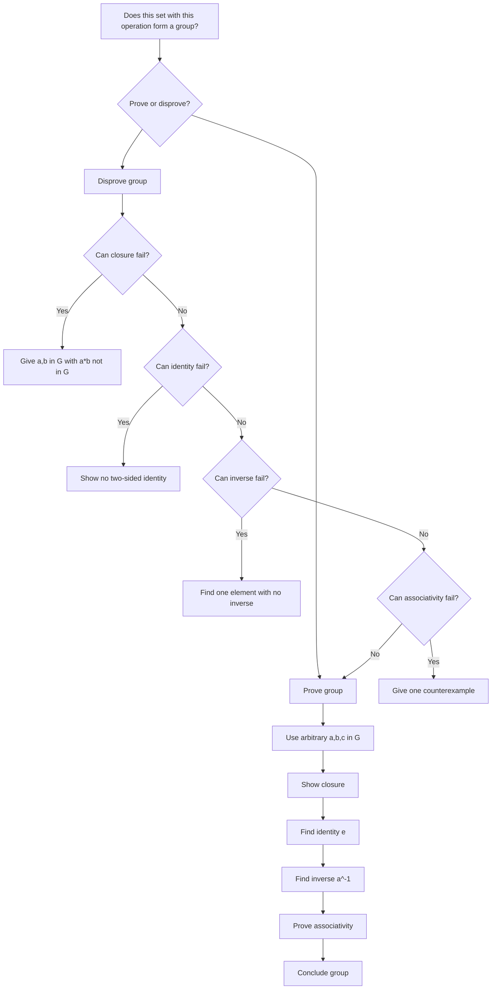

# Mermaid Asset: FAS2GroupTheoryMermaid-002

## Asset metadata

| Field | Value |
|---|---|
| Asset ID | `FAS2GroupTheoryMermaid-002` |
| Topic ID | `FAS2GroupTheory` |
| Related lesson file | `FAS2_group_theory_lesson.md` |
| Used placeholder | `FAS2GroupTheoryMermaid-002` |
| Source | Transcript proof and group-check examples |
| Purpose | Decide whether to prove a group or disprove it using one failed axiom. |

