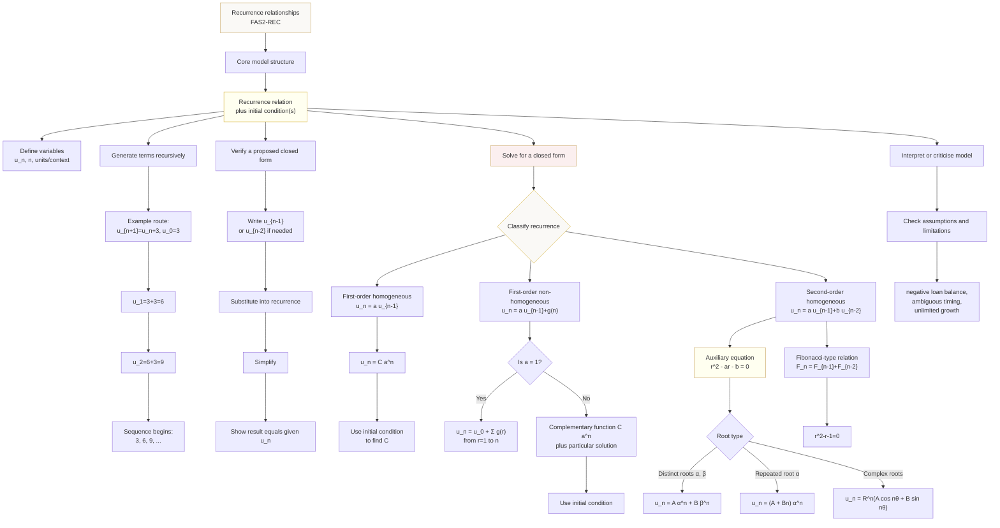

# FAS2RecurrenceRelationshipsMermaid-001

## Accessibility description

A top-down flowchart beginning with the core structure recurrence relation plus initial conditions. It branches to generating terms, verifying a closed form, solving first-order relations, solving second-order homogeneous relations, Fibonacci-type relations, and model criticism.
