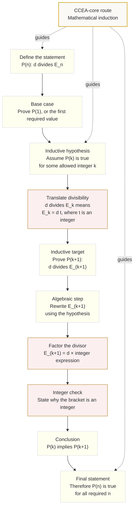

# Mermaid Asset: FA21ProofDivisibilityLanguageSupportMermaid-001

## Asset ID

`FA21ProofDivisibilityLanguageSupportMermaid-001`

## Source

CCEA `FA21-PROOF-LO001` boundary + Phase 1 lesson core theory.

## Related Lesson Section

- `# 8. Core Theory`
- `# 9. Visual Asset Integration`
- `# 15. Exam Technique Notes`

## Used Placeholder

```text
[VISUAL PLACEHOLDER: FA21ProofDivisibilityLanguageSupportMermaid-001 | Source: CCEA `FA21-PROOF-LO001` + lesson core theory | Insert from mermaid/FA21ProofDivisibilityLanguageSupportMermaid-001.md | Purpose: Show the logical flow of a divisibility induction proof.]
```

## Purpose

Show the CCEA-core logical flow for a divisibility proof by mathematical induction.

## Creation Notes

This diagram deliberately keeps the route centred on induction. Divisor notation appears only as proof language support. Euclidean algorithm, modular arithmetic and other FP2 Number Theory methods are not included in this core proof flow.

## Mermaid Code


