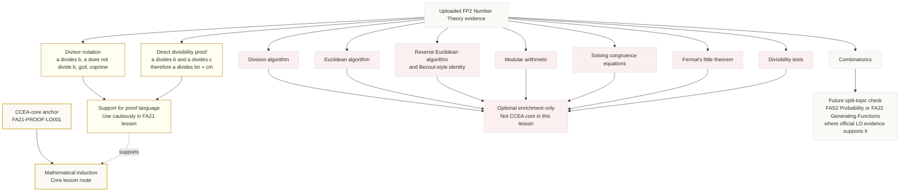

# Mermaid Asset: FA21ProofDivisibilityLanguageSupportMermaid-002

## Asset ID

`FA21ProofDivisibilityLanguageSupportMermaid-002`

## Source

CCEA Further Mathematics specification boundary + uploaded FP2 Number Theory evidence + Phase 1 syllabus gap check.

## Related Lesson Section

- `# 3. Specification Alignment`
- `# 9. Visual Asset Integration`
- `# 16. Syllabus Gap Check`
- `# 17. Recommended Enhancements Not in the Evidence`

## Used Placeholder

```text
[VISUAL PLACEHOLDER: FA21ProofDivisibilityLanguageSupportMermaid-002 | Source: CCEA Further Maths specification boundary + uploaded FP2 Number Theory evidence | Insert from mermaid/FA21ProofDivisibilityLanguageSupportMermaid-002.md | Purpose: Help students see which uploaded Number Theory topics are core, support, or enrichment.]
```

## Purpose

Show the boundary between the CCEA-core proof outcome, support material from the uploaded Number Theory evidence, off-spec enrichment, and future split-topic content.

## Creation Notes

This diagram is a guardrail map. It prevents the uploaded FP2 Number Theory chapter from being silently treated as an official CCEA Number Theory topic. The only CCEA-core anchor used in this lesson is `FA21-PROOF-LO001`.

## Mermaid Code


