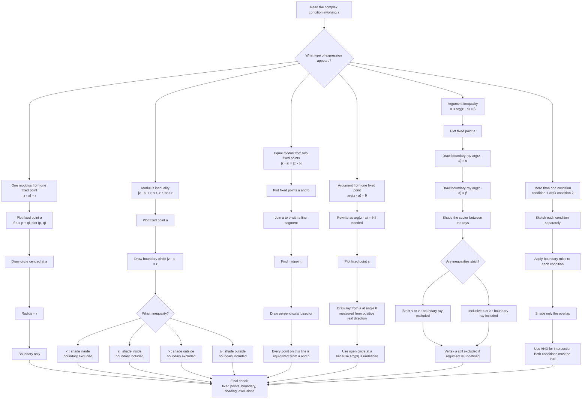

# FAS1ComplexNumbersLociRegionsMermaid-001

## Purpose

This diagram helps a student decide what type of Argand diagram object is produced by a complex-number condition.

## Mermaid code

## Student-facing interpretation notes

- \(|z-a|=r\): circle centred at \(a\), radius \(r\).
- \(|z-a|=|z-b|\): perpendicular bisector of the segment joining \(a\) and \(b\).
- \(\arg(z-a)=\theta\): ray from \(a\); \(a\) is excluded because \(\arg(0)\) is undefined.
- Inequalities create regions. The word “and” means overlap.
