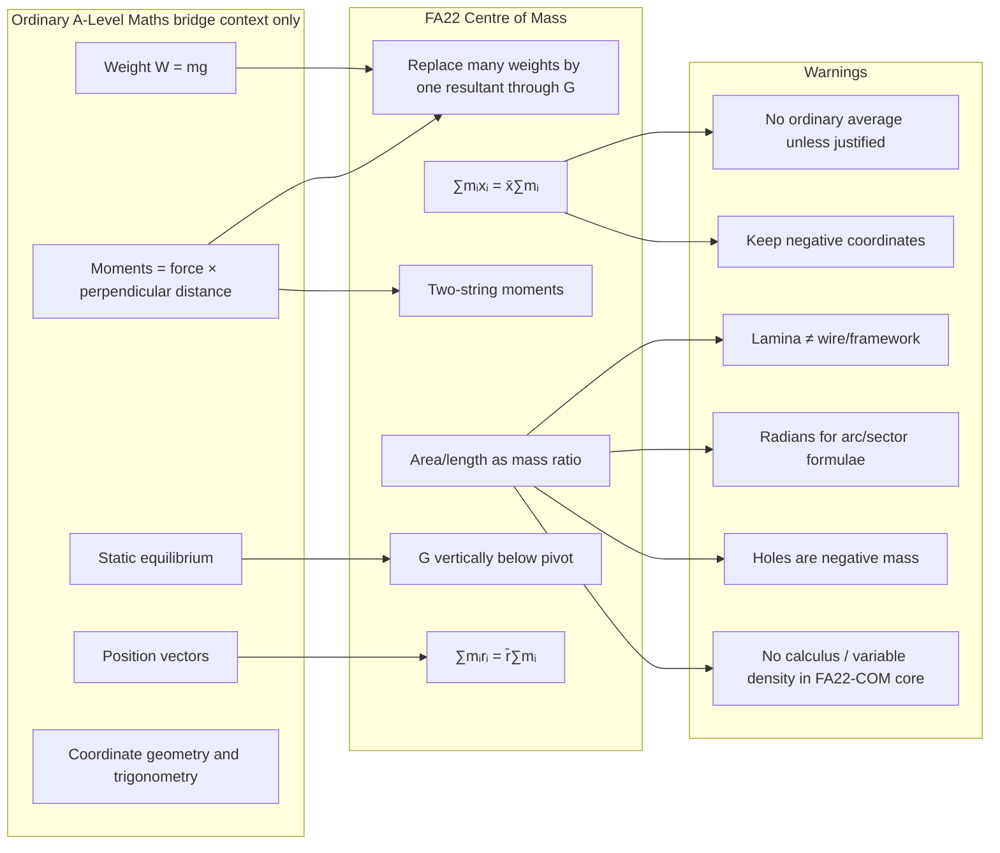

# Mermaid Asset: FA22CentreOfMassBridgeMermaid-001

| Field | Value |
|---|---|
| Asset ID | FA22CentreOfMassBridgeMermaid-001 |
| Source | Ordinary A-Level Maths bridge + Further Maths specification |
| Related lesson section | Section 9.2 Visual Placeholder: Ordinary Maths Bridge Map |
| Used placeholder | `[VISUAL PLACEHOLDER: FA22CentreOfMassBridgeMermaid-001 | Source: Ordinary A-Level Maths bridge + Further Maths specification | Insert from mermaid/FA22CentreOfMassBridgeMermaid-001.md | Purpose: Compare prior ordinary Maths method with Further Maths extension.]` |
| Purpose | Compare ordinary A-Level Mechanics and Vectors with Further Maths centre-of-mass methods. |

