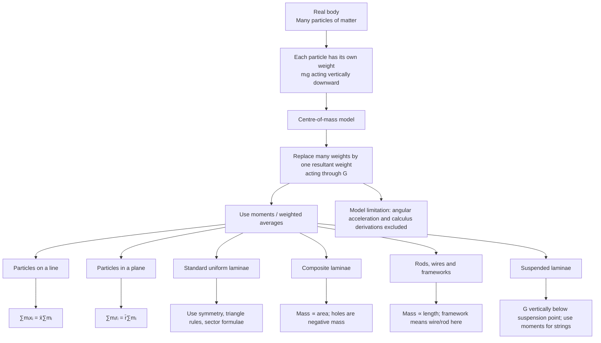

# Mermaid Asset: FA22CentreOfMassMermaid-001

| Field | Value |
|---|---|
| Asset ID | FA22CentreOfMassMermaid-001 |
| Source | CCEA `FA22-COM` specification boundary + uploaded lesson evidence |
| Related lesson section | Section 9.1 Visual Placeholder: Concept Flow |
| Used placeholder | `[VISUAL PLACEHOLDER: FA22CentreOfMassMermaid-001 | Source: CCEA FA22-COM specification boundary + uploaded lesson evidence | Insert from mermaid/FA22CentreOfMassMermaid-001.md | Purpose: Show the whole lesson flow from the centre-of-mass model to particles, laminae, composites, frameworks and suspended laminae.]` |
| Purpose | Show the whole lesson flow from the physical model to the repeated centre-of-mass calculation methods. |

