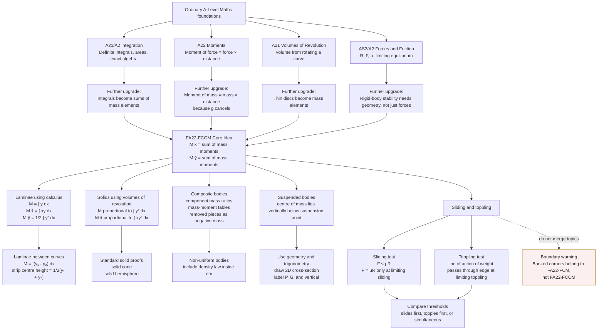

# Mermaid Asset: FA22FurtherCentreOfMassMermaid-001

## Asset Metadata

| Field | Value |
|---|---|
| Asset ID | FA22FurtherCentreOfMassMermaid-001 |
| Asset type | Mermaid diagram |
| Unit | FA22: Further A2 2 Applied Mathematics |
| Applied section | Section B: Mechanics 2 |
| Topic code | FA22-FCOM |
| Topic name | Further centre of mass |
| Topic ID | FA22FurtherCentreOfMass |
| Related lesson file | FA22_further_centre_of_mass_lesson.md |
| Related lesson section | # 9. Visual Asset Integration; # 6. Big Picture Explanation; # 8. Core Theory |
| Used placeholder | `[VISUAL PLACEHOLDER: FA22FurtherCentreOfMassMermaid-001 | Source: CCEA FA22-FCOM specification boundary + teacher transcript overview | Insert from mermaid/FA22FurtherCentreOfMassMermaid-001.md | Purpose: Show how the topic grows from ordinary moments and integration into laminae, solids, composite bodies, suspended bodies, sliding and toppling.]` |
| Source | CCEA FA22-FCOM specification boundary + teacher transcript overview |
| Purpose | Show how ordinary A-Level Maths ideas grow into FA22 Further Centre of Mass methods, while marking the key syllabus boundary that banked corners belong elsewhere. |
| Creation status | Generated in Phase 2 |

## Mermaid Code

## Accessibility Description

This flowchart begins with ordinary A-Level Maths foundations: integration, moments, volumes of revolution, and forces/friction. Each foundation points to a Further Mechanics upgrade. These upgrades combine into the core centre-of-mass equation. From there, the diagram branches into laminae, solids, composite bodies, non-uniform bodies, suspended bodies, and sliding/toppling. A warning box states that banked corners belong to `FA22-FCM`, not `FA22-FCOM`.
