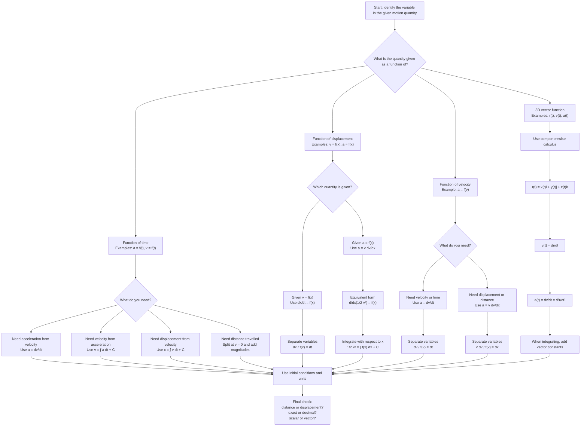

# Mermaid Asset: FA22FurtherKinematicsMermaid-001

## Asset metadata

| Field | Value |
|---|---|
| Asset ID | `FA22FurtherKinematicsMermaid-001` |
| Asset type | Mermaid diagram |
| Topic ID | `FA22FurtherKinematics` |
| Unit | `FA22`: Further A2 2 Applied Mathematics |
| Topic code | `FA22-FKIN` |
| Related lesson file | `FA22_further_kinematics_lesson.md` |
| Related lesson section | `# 9. Visual Asset Integration`, `# 8. Core Theory` |
| Used placeholder | `[VISUAL PLACEHOLDER: FA22FurtherKinematicsMermaid-001 | Source: CCEA FA22-FKIN boundary + transcript summary slide | Insert from mermaid/FA22FurtherKinematicsMermaid-001.md | Purpose: Show how to choose the correct kinematics equation depending on whether the given function involves \(t\), \(x\), or \(v\).]` |
| Source | CCEA FA22-FKIN boundary + transcript summary of functions of time, displacement and velocity |
| Purpose | Show how to choose the correct kinematics relation depending on whether the given quantity is a function of \(t\), \(x\), or \(v\). |

## Creation notes

This decision tree supports `FA22-FKIN-LO002`.

It separates the three major straight-line variable acceleration cases:

1. Functions of time:
   \[
   a=f(t),\qquad v=f(t)
   \]
2. Functions of displacement:
   \[
   v=f(x),\qquad a=f(x)
   \]
3. Functions of velocity:
   \[
   a=f(v)
   \]

The key exam decision is not “which formula do I remember?” but:

```text
What is given, and what am I trying to find?
```

For distance and displacement questions involving \(a=f(v)\), the route is usually:

\[
a=v\frac{dv}{dx}.
\]

For velocity and time questions involving \(a=f(v)\), the route is usually:

\[
a=\frac{dv}{dt}.
\]

## Mermaid code


