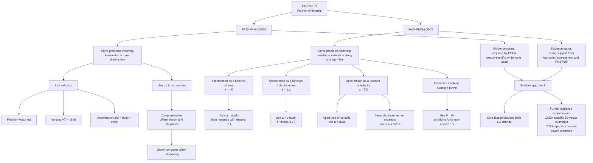

# Mermaid Asset: FA22FurtherKinematicsMermaid-002

## Asset metadata

| Field | Value |
|---|---|
| Asset ID | `FA22FurtherKinematicsMermaid-002` |
| Asset type | Mermaid diagram |
| Topic ID | `FA22FurtherKinematics` |
| Unit | `FA22`: Further A2 2 Applied Mathematics |
| Topic code | `FA22-FKIN` |
| Related lesson file | `FA22_further_kinematics_lesson.md` |
| Related lesson section | `# 3. Specification Alignment`, `# 16. Syllabus Gap Check` |
| Used placeholder | `[VISUAL PLACEHOLDER: FA22FurtherKinematicsMermaid-002 | Source: CCEA Further Mathematics specification map | Insert from mermaid/FA22FurtherKinematicsMermaid-002.md | Purpose: Separate the two CCEA FKIN learning outcomes and show which parts of the lesson support each one.]` |
| Source | CCEA Further Mathematics specification map |
| Purpose | Show how the lesson separates `FA22-FKIN-LO001` and `FA22-FKIN-LO002`, including the evidence strength for each strand. |

## Creation notes

This diagram is a coverage map, not a method diagram.

It records the important syllabus distinction:

- `FA22-FKIN-LO001` requires **three-dimensional kinematics** using calculus and \(\mathbf{i},\mathbf{j},\mathbf{k}\).
- `FA22-FKIN-LO002` requires **straight-line variable acceleration** where acceleration may be a function of time, velocity or displacement, including examples involving constant power.

The supplied lesson evidence is strong for `FA22-FKIN-LO002`, but weak for `FA22-FKIN-LO001`. The diagram preserves that evidence limitation rather than hiding it.

## Mermaid code

