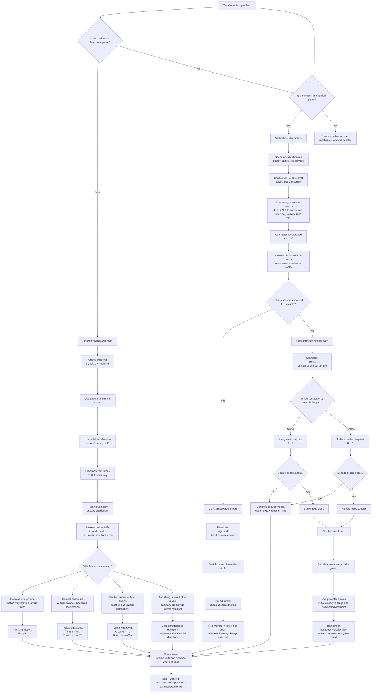

# FAS2CircularMotionMermaid-001

## Asset Metadata

| Field | Value |
|---|---|
| Asset ID | `FAS2CircularMotionMermaid-001` |
| Asset type | Mermaid diagram |
| Topic ID | `FAS2CircularMotion` |
| Unit | `FAS2`: Further AS 2 Applied Mathematics |
| Topic codes | `FAS2-CM`, `FAS2-FCM` |
| Related lesson file | `FAS2_circular_motion_lesson.md` |
| Related lesson section | `# 9. Visual Asset Integration` |
| Used placeholder | `[VISUAL PLACEHOLDER: FAS2CircularMotionMermaid-001 | Source: CCEA Further Maths specification boundary + lesson PDF chapter overview + teacher transcript | Insert from mermaid/FAS2CircularMotionMermaid-001.md | Purpose: Show the decision pathway for circular motion problems. The diagram must branch into horizontal circles, vertical circles, constrained vertical circles, unconstrained vertical circles, and projectile motion after leaving the path.]` |
| Source | CCEA Further Maths specification boundary + lesson PDF chapter overview + teacher transcript |
| Purpose | Show the decision pathway for circular motion problems, separating horizontal-circle methods from vertical-circle methods. |

## Creation Notes

This Mermaid diagram supports the main lesson’s method-selection strategy. It preserves the evidence-backed distinction between horizontal circular motion with constant speed, vertical circular motion where speed usually changes, constrained vertical-circle motion, unconstrained vertical-circle motion, and projectile motion after leaving the circular path.

## Mermaid Diagram

## Accessibility Description

This flowchart begins with a circular motion problem and splits the problem into horizontal-plane and vertical-plane cases. It ends with a warning that “centripetal force” must not be added as a separate force.
