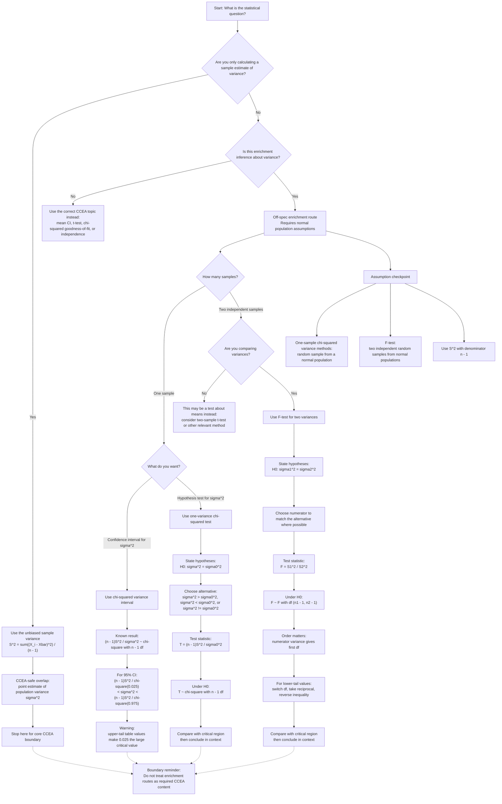

# Mermaid Asset: FA22FurtherHypothesisTestsVarianceEnrichmentMermaid-001

## Asset Metadata

| Field | Value |
|---|---|
| `asset_id` | `FA22FurtherHypothesisTestsVarianceEnrichmentMermaid-001` |
| `unit_code` | `FA22` |
| `topic_id` | `FA22FurtherHypothesisTestsVarianceEnrichment` |
| `topic_slug` | `further_hypothesis_tests_variance_enrichment` |
| `asset_type` | Mermaid diagram |
| `related_lesson_file` | `FA22_further_hypothesis_tests_variance_enrichment_lesson.md` |
| `related_lesson_section` | Section 9: Visual Asset Integration |
| `used_placeholder` | `[VISUAL PLACEHOLDER: FA22FurtherHypothesisTestsVarianceEnrichmentMermaid-001 | Source: Lesson synthesis from transcript and bridge context | Insert from mermaid/FA22FurtherHypothesisTestsVarianceEnrichmentMermaid-001.md | Purpose: Decision tree for choosing between S² calculation, χ² variance confidence interval, one-variance χ² test and two-variance F-test.]` |
| `source` | Lesson synthesis from teacher transcript and ordinary A-Level Maths bridge context |
| `source_status` | Off-spec enrichment evidence, not CCEA core |
| `purpose` | Decision tree for choosing between \(S^2\) calculation, \(\chi^2\) variance confidence interval, one-variance \(\chi^2\) test and two-variance \(F\)-test |
| `visual_style_note` | Luxury-minimalist palette to be applied in later rendered versions: ivory/cream background, muted dividers, gold accents, dark mathematical text |

## Creation Notes

This Mermaid diagram is a method-selection map for the off-spec enrichment lesson.

It preserves the key boundary:

- the CCEA-safe overlap is calculating \(S^2\) as an unbiased estimator of \(\sigma^2\);
- \(\chi^2\) variance confidence intervals, one-variance \(\chi^2\) tests, \(F\)-distribution theory and \(F\)-tests are enrichment only.

## Mermaid Code

## Accessibility Description

This flowchart begins with the question “What is the statistical question?” It first separates the CCEA-safe task of calculating the unbiased sample variance \(S^2\) from the off-spec enrichment tasks. The enrichment branch splits into one-sample and two-sample routes. The one-sample route splits again into confidence intervals for \(\sigma^2\) and hypothesis tests for \(\sigma^2\), both using the \(\chi^2\) distribution with \(n-1\) degrees of freedom. The two-sample route leads to the \(F\)-test for comparing population variances, using \(F=S_1^2/S_2^2\) with degrees of freedom \(n_1-1\) and \(n_2-1\). A final assumption checkpoint reminds the student that normality and correct use of \(S^2\) are required, and that the whole inference route is enrichment rather than CCEA core.

## Off-Spec Boundary Note

This asset supports an enrichment lesson only. It must not be used to imply that \(\chi^2\) variance confidence intervals, one-variance \(\chi^2\) tests, the \(F\)-distribution or \(F\)-tests are required CCEA FA22 content unless official CCEA evidence is later supplied.
