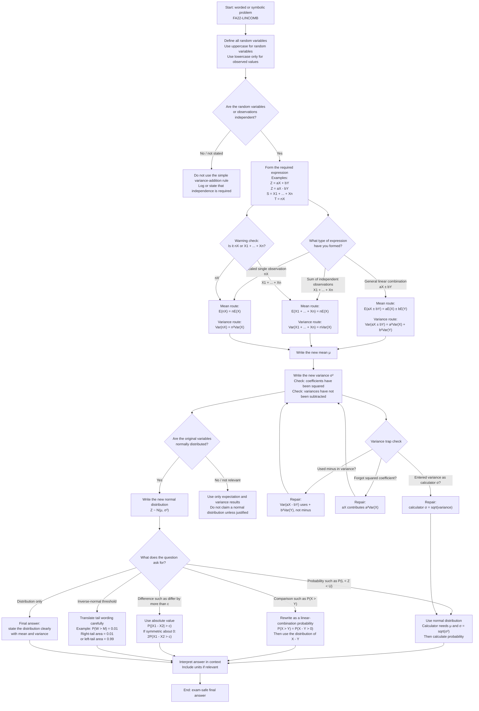

# FA22LinearCombinationsOfIndependentVariablesMermaid-001

```mermaid
flowchart TD
    A["Start: worded or symbolic problem<br/>FA22-LINCOMB"] --> B["Define all random variables<br/>Use uppercase for random variables<br/>Use lowercase only for observed values"]
    B --> C{"Are the random variables<br/>or observations independent?"}
    C -- "No / not stated" --> C0["Do not use the simple variance-addition rule<br/>Log or state that independence is required"]
    C -- "Yes" --> D["Form the required expression<br/>Examples:<br/>Z = aX + bY<br/>Z = aX - bY<br/>S = X1 + ... + Xn<br/>T = nX"]
    D --> E{"What type of expression<br/>have you formed?"}
    E -- "General linear combination<br/>aX ± bY" --> F["Mean route:<br/>E(aX ± bY) = aE(X) ± bE(Y)<br/><br/>Variance route:<br/>Var(aX ± bY) = a²Var(X) + b²Var(Y)"]
    E -- "Sum of independent observations<br/>X1 + ... + Xn" --> G["Mean route:<br/>E(X1 + ... + Xn) = nE(X)<br/><br/>Variance route:<br/>Var(X1 + ... + Xn) = nVar(X)"]
    E -- "Scaled single observation<br/>nX" --> H["Mean route:<br/>E(nX) = nE(X)<br/><br/>Variance route:<br/>Var(nX) = n²Var(X)"]
    F --> I["Write the new mean μ"]
    G --> I
    H --> I
    I --> J["Write the new variance σ²<br/>Check: coefficients have been squared<br/>Check: variances have not been subtracted"]
    J --> K{"Are the original variables<br/>normally distributed?"}
    K -- "Yes" --> L["Write the new normal distribution<br/>Z ~ N(μ, σ²)"]
    K -- "No / not relevant" --> L0["Use only expectation and variance results<br/>Do not claim a normal distribution unless justified"]
    L --> M{"What does the question ask for?"}
    M -- "Distribution only" --> N["Final answer:<br/>state the distribution clearly<br/>with mean and variance"]
    M -- "Probability such as P(L < Z < U)" --> O["Use normal distribution<br/>Calculator needs μ and σ = sqrt(σ²)<br/>Then calculate probability"]
    M -- "Comparison such as P(X > Y)" --> P["Rewrite as a linear-combination probability<br/>P(X > Y) = P(X - Y > 0)<br/>Then use the distribution of X - Y"]
    M -- "Difference such as differ by more than c" --> Q["Use absolute value<br/>P(|X1 - X2| > c)<br/>If symmetric about 0:<br/>2P(X1 - X2 > c)"]
    M -- "Inverse-normal threshold" --> R["Translate tail wording carefully<br/>Example: P(W > M) = 0.01<br/>Right-tail area = 0.01<br/>or left-tail area = 0.99"]
    O --> S["Interpret answer in context<br/>Include units if relevant"]
    P --> S
    Q --> S
    R --> S
    N --> S
    S --> T["End: exam-safe final answer"]
    D --> W{"Warning check:<br/>Is it nX or X1 + ... + Xn?"}
    W -- "nX" --> H
    W -- "X1 + ... + Xn" --> G
    J --> X{"Variance trap check"}
    X -- "Used minus in variance?" --> X1["Repair:<br/>Var(aX - bY) uses + b²Var(Y), not minus"]
    X -- "Forgot squared coefficient?" --> X2["Repair:<br/>aX contributes a²Var(X)"]
    X -- "Entered variance as calculator σ?" --> X3["Repair:<br/>calculator σ = sqrt(variance)"]
    X1 --> J
    X2 --> J
    X3 --> O
```
