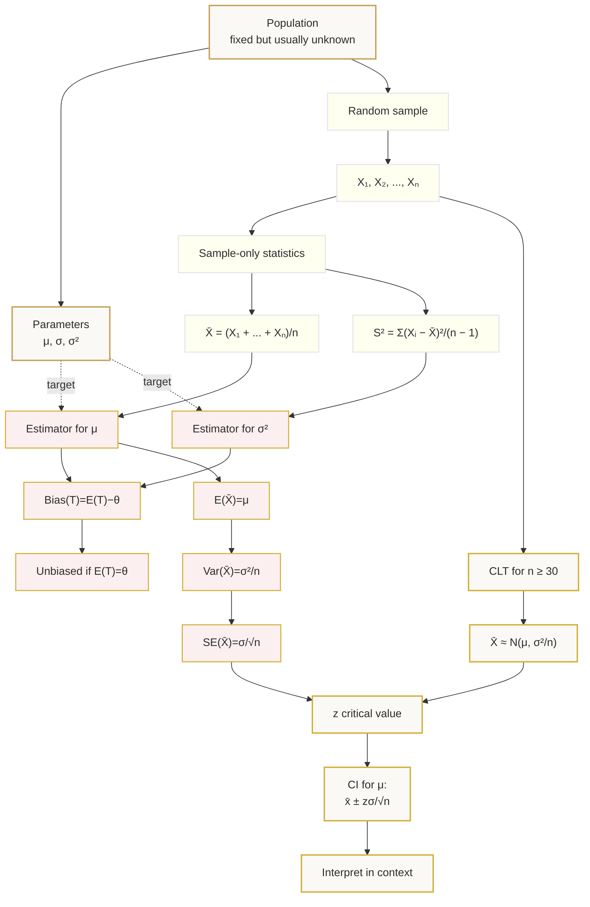

# FA22SamplingAndEstimationMermaid-001

## Asset metadata

| Field | Value |
|---|---|
| Asset ID | FA22SamplingAndEstimationMermaid-001 |
| Asset type | Mermaid diagram |
| Unit | FA22 – Further A2 2 Applied Mathematics |
| Topic code | FA22-EST |
| Topic name | Sampling and estimation |
| Related lesson file | FA22_sampling_and_estimation_lesson.md |
| Used placeholder | `[VISUAL PLACEHOLDER: FA22SamplingAndEstimationMermaid-001 ...]` |
| Source | CCEA FA22-EST specification map + teacher transcript + supplied estimation/confidence interval PDF |
| Purpose | Show the conceptual flow from population parameters to sample observations, estimators, bias, standard error, CLT and confidence intervals. |

## Mermaid code

## Accessibility notes

The diagram uses text labels rather than colour alone. Dotted arrows show that estimators aim at unknown target parameters but are calculated from sample data only.
