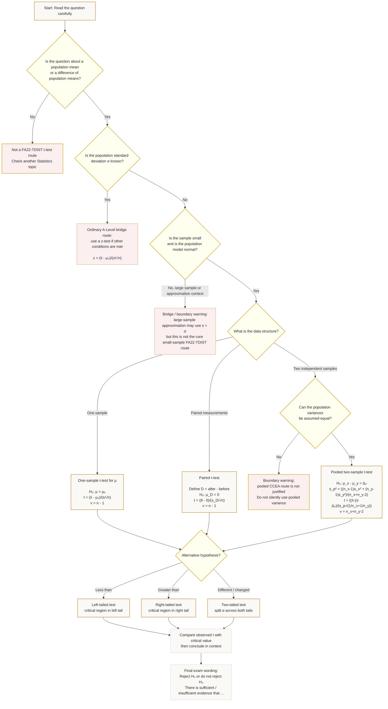

# Mermaid Asset: FA22TDistributionMermaid-001

## Asset ID

`FA22TDistributionMermaid-001`

## Source

- CCEA Further Mathematics topic boundary: `FA22-TDIST`
- Learning outcomes:
  - `FA22-TDIST-LO001`
  - `FA22-TDIST-LO002`
  - `FA22-TDIST-LO003`
- Phase 1 lesson sections:
  - `# 8. Core Theory`
  - `# 9. Visual Asset Integration`
  - `# 15. Exam Technique Notes`
  - `# 16. Syllabus Gap Check`

## Related lesson section

`# 9.1 Distribution-choice flowchart`

## Used placeholder

```text
[VISUAL PLACEHOLDER: FA22TDistributionMermaid-001 | Source: CCEA FA22-TDIST learning outcomes + lesson evidence | Insert from mermaid/FA22TDistributionMermaid-001.md | Purpose: Help the student decide whether a question needs a one-sample t-test, paired t-test, two-sample pooled t-test or ordinary bridge z-test.]
```

## Purpose

This Mermaid diagram helps the student decide which statistical test is appropriate when a question involves a mean or a difference of means.

## Mermaid code


