# Mermaid Asset: FAS2ContinuousDistributionsMermaid-001

## Asset metadata

| Field | Value |
|---|---|
| Asset ID | `FAS2ContinuousDistributionsMermaid-001` |
| Unit | `FAS2` |
| Topic code | `FAS2-DIST` |
| Topic ID | `FAS2ContinuousDistributions` |
| Lesson file | `FAS2_continuous_distributions_lesson.md` |
| Related lesson section | Section 9.1 Topic flow visual |
| Source | CCEA FAS2-DIST specification boundary + DrFrost/Pearson Chapter 3 continuous distributions lesson evidence |
| Purpose | Show the learning route from discrete probability functions to continuous p.d.f.s, CDFs, mean, variance and transformation rules. |

## Mermaid code

```mermaid
flowchart TD
    A["FAS2-DIST<br/>Statistical distributions"] --> B["Discrete recap"]
    B --> B1["Discrete random variable<br/>separate/countable outcomes"]
    B1 --> B2["Probability function<br/>p(x) = P(X = x)"]
    B2 --> B3["Conditions<br/>p(x) ≥ 0<br/>Σp(x) = 1"]
    B3 --> B4["Exact outcome probabilities can be non-zero"]
    B4 --> C["Continuous random variable"]
    C --> C1["Continuous outcomes<br/>values across an interval"]
    C1 --> C2["Exact point probability<br/>P(X = a) = 0"]
    C2 --> C3["Use intervals instead<br/>P(a < X < b)"]
    C3 --> D["Probability density function"]
    D --> D1["f(x) is density, not probability"]
    D1 --> D2["Core warning<br/>Do not read f(x) as P(X = x)"]
    D2 --> D3["p.d.f. conditions<br/>f(x) ≥ 0<br/>∫ f(x) dx = 1"]
    D3 --> E["Probability as area"]
    E --> E1["P(a < X < b)<br/>= ∫ from a to b f(x) dx"]
    E1 --> E2["Endpoint signs do not change probability"]
    E2 --> F["Cumulative distribution function"]
    F --> F1["F(x) = P(X ≤ x)"]
    F1 --> F2["F(x) = ∫ from -∞ to x f(t) dt"]
    F2 --> F3["Use t inside the integral<br/>when x is the upper limit"]
    F3 --> F4["Recover p.d.f.<br/>f(x) = dF(x)/dx"]
    F4 --> G["Mean and variance"]
    G --> G1["E(X) = ∫ x f(x) dx"]
    G1 --> G2["E(X²) = ∫ x² f(x) dx"]
    G2 --> G3["Var(X) = E(X²) - [E(X)]²"]
    G3 --> G4["SD(X) = √Var(X)"]
    G4 --> H["Linear transformations"]
    H --> H1["E(aX + b) = aE(X) + b"]
    H1 --> H2["Var(aX + b) = a²Var(X)"]
    H2 --> H3["+b shifts centre<br/>but does not change spread"]
    G4 --> I["Simple continuous uniform model"]
    I --> I1["X ~ U[a,b]"]
    I1 --> I2["f(x) = 1/(b-a)<br/>for a ≤ x ≤ b"]
    I2 --> I3["P(c < X < d) = (d-c)/(b-a)"]
    I3 --> I4["E(X) = (a+b)/2<br/>Var(X) = (b-a)²/12"]
    B3 -. "bridge idea" .-> J["Summation becomes integration"]
    J -. "Σp(x)=1" .-> D3
    J -. "discrete adding → continuous area" .-> E
    K["Histogram bridge"] --> K1["frequency density"]
    K1 --> K2["area of bar gives frequency"]
    K2 --> D1
    K2 --> E
    classDef core fill:#FAF9F6,stroke:#C5A059,stroke-width:2px,color:#2C2C2E;
    classDef warning fill:#FBEFEF,stroke:#D4AF37,stroke-width:2px,color:#2C2C2E;
    classDef bridge fill:#FFFFF0,stroke:#E5E5EA,stroke-width:1.5px,color:#2C2C2E;
    class A,B,C,D,E,F,G,H,I core;
    class D2,H3 warning;
    class J,K,K1,K2 bridge;
```

