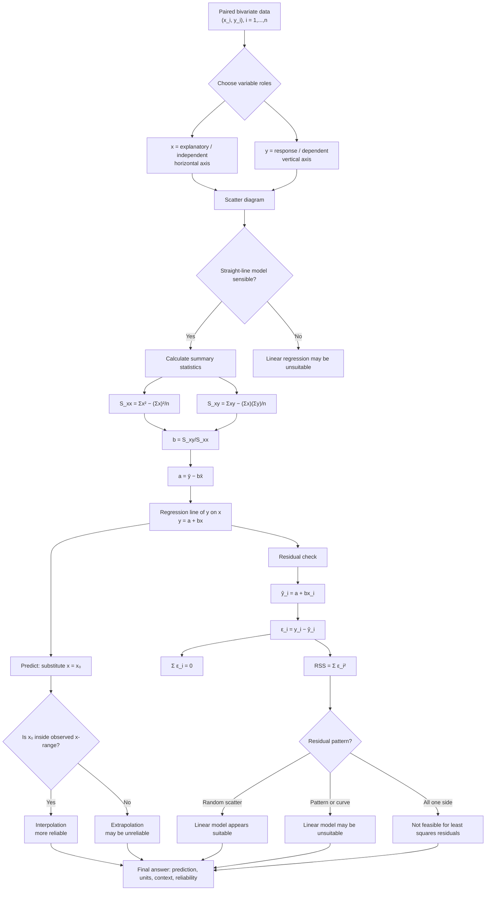

# Mermaid Asset: FAS2LinearRegressionMermaid-001

| Field | Value |
|---|---|
| Asset ID | FAS2LinearRegressionMermaid-001 |
| Asset type | Mermaid flowchart |
| Lesson file | FAS2_linear_regression_lesson.md |
| Topic ID | FAS2LinearRegression |
| Unit | FAS2 |
| Topic code | FAS2-BIV |
| Source | CCEA FAS2-BIV specification boundary + teacher transcript |
| Related lesson section | Section 9.1 Concept flow diagram |
| Purpose | Show paired data to variable roles, least squares calculation, prediction and residual checking. |

