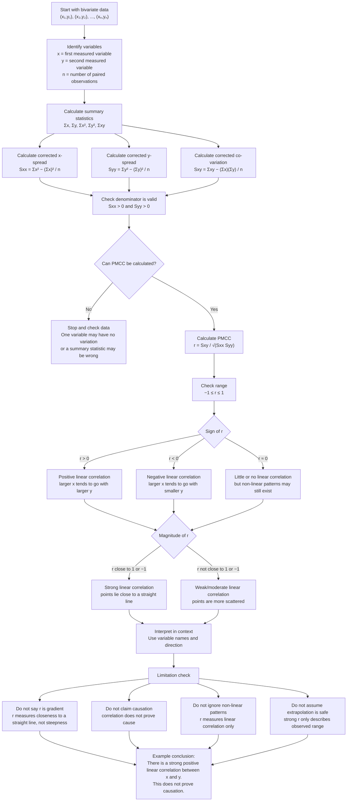

# FAS2ProductMomentCorrelationCoefficientMermaid-001

## Asset Metadata

| Field | Value |
|---|---|
| Asset ID | `FAS2ProductMomentCorrelationCoefficientMermaid-001` |
| Unit | `FAS2` |
| Topic code | `FAS2-BIV` |
| Topic ID | `FAS2ProductMomentCorrelationCoefficient` |
| Related lesson file | `FAS2_product_moment_correlation_coefficient_lesson.md` |
| Related lesson section | `# 9. Visual Asset Integration`; supports `# 8. Core Theory`, `# 11. Worked Examples`, `# 15. Exam Technique Notes` |
| Used placeholder | `[VISUAL PLACEHOLDER: FAS2ProductMomentCorrelationCoefficientMermaid-001 | Source: CCEA FAS2-BIV-LO001 + transcript PMCC method | Insert from mermaid/FAS2ProductMomentCorrelationCoefficientMermaid-001.md | Purpose: Show the full PMCC calculation workflow from bivariate data to interpretation. Description: Flowchart should show paired data, summary statistics, calculation of Sxx/Syy/Sxy, calculation of r, then interpretation and limitation check.]` |
| Source | CCEA FAS2-BIV-LO001 + teacher transcript PMCC method + lesson Phase 1 core theory |
| Purpose | Show the full PMCC calculation workflow from paired bivariate data to final interpretation and limitation checks. |
| Creation notes | This is a teaching workflow diagram. It preserves the core PMCC method from the lesson: start with paired observations, compute summary statistics, calculate corrected sums, compute \(r\), interpret direction/strength, then check limitations. Spearman’s rank and hypothesis testing are deliberately excluded because Phase 1 logged them as boundary-risk/enrichment, not core CCEA FAS2 PMCC content. |

## Mermaid Code

