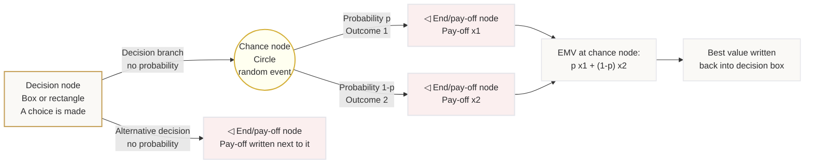

# Mermaid Asset: OffSpecDecisionAnalysisMermaid-001

## Asset metadata

| Field | Value |
|---|---|
| Asset ID | OffSpecDecisionAnalysisMermaid-001 |
| Source | `transcripts.md`, Decision Analysis 1, node-shape and decision-tree method explanation |
| Related lesson section | Section 7: Key Definitions and Notation; Section 8: Core Theory |
| Used placeholder | `[VISUAL PLACEHOLDER: OffSpecDecisionAnalysisMermaid-001 | Source: transcripts.md | Insert from mermaid/OffSpecDecisionAnalysisMermaid-001.md | Purpose: Summarise the decision-tree node grammar.]` |
| Purpose | Show the core diagram grammar: decision node, chance node, end/pay-off node, probabilities, pay-offs and EMV placement. |

## Mermaid code

