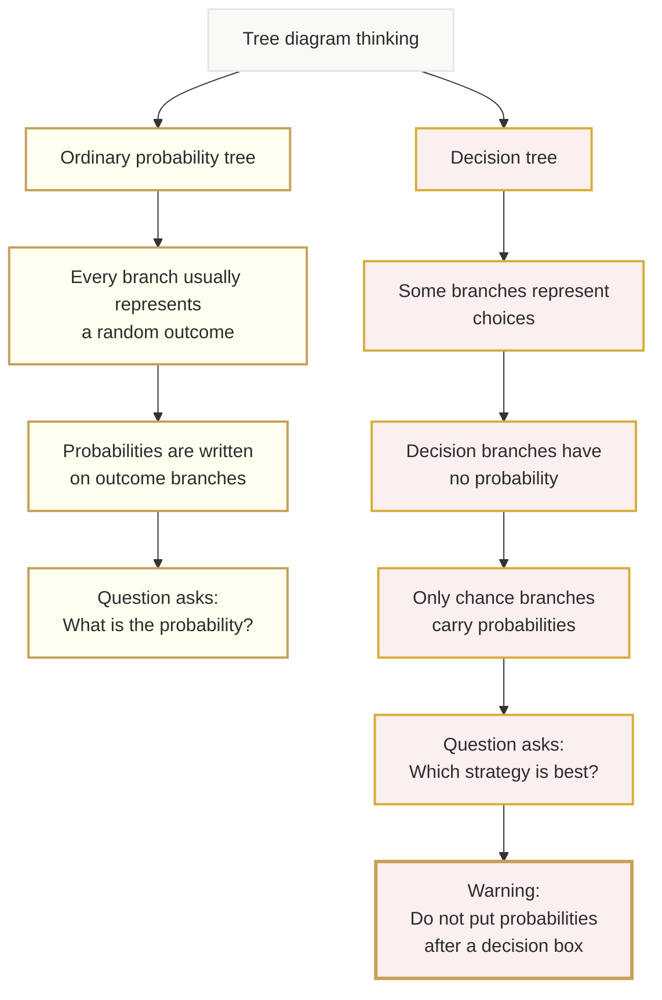

# Mermaid Asset: OffSpecDecisionAnalysisMermaid-002

## Asset metadata

| Field | Value |
|---|---|
| Asset ID | OffSpecDecisionAnalysisMermaid-002 |
| Source | `transcripts.md`, decision trees versus probability trees warning |
| Related lesson section | Section 5; Section 8; Section 12 |
| Used placeholder | `[VISUAL PLACEHOLDER: OffSpecDecisionAnalysisMermaid-002 | Source: transcripts.md + ordinary A-Level Maths bridge | Insert from mermaid/OffSpecDecisionAnalysisMermaid-002.md | Purpose: Compare probability-tree thinking with decision-tree thinking.]` |
| Purpose | Prevent the classic trap: putting probabilities on decision branches. |

## Mermaid code

