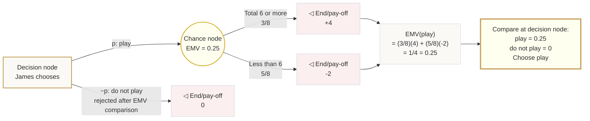

# Mermaid Asset: OffSpecDecisionAnalysisMermaid-003

## Asset metadata

| Field | Value |
|---|---|
| Asset ID | OffSpecDecisionAnalysisMermaid-003 |
| Source | `transcripts.md`, James tetrahedral dice worked example |
| Related lesson section | Section 11 Worked Example 1 |
| Used placeholder | `[VISUAL PLACEHOLDER: OffSpecDecisionAnalysisMermaid-003 | Source: transcripts.md | Insert from mermaid/OffSpecDecisionAnalysisMermaid-003.md | Purpose: Show James’s play/not-play EMV decision tree.]` |
| Purpose | Represent the James example with probabilities, pay-offs, EMV and rejected branch. |

## Mermaid code

