# Mermaid Asset: OffSpecDecisionAnalysisMermaid-004

## Asset metadata

| Field | Value |
|---|---|
| Asset ID | OffSpecDecisionAnalysisMermaid-004 |
| Source | `transcripts.md`, Jess two-dice and third-die worked example |
| Related lesson section | Section 11 Worked Example 2 |
| Used placeholder | `[VISUAL PLACEHOLDER: OffSpecDecisionAnalysisMermaid-004 | Source: transcripts.md | Insert from mermaid/OffSpecDecisionAnalysisMermaid-004.md | Purpose: Show Jess’s multi-stage decision tree and backward EMV logic.]` |
| Purpose | Show nested decisions and backward EMV logic. |

## Mermaid code

```mermaid
flowchart LR
    D0["Decision node<br/>Jess chooses"] -->|p: play| C1(("Chance node<br/>EMV = -1/3 ≈ -0.33"))
    D0 -->|~p: do not play<br/>chosen initially| E0["◁ End/pay-off<br/>0"]
    C1 -->|Same score<br/>1/6| E1["◁ End/pay-off<br/>+3<br/>(wins 5, paid 2)"]
    C1 -->|Different score<br/>5/6| D2["Decision node<br/>After losing first roll"]
    D2 -->|Play again<br/>chosen if reached| C2(("Chance node<br/>EMV = -1"))
    D2 -->|Do not play again<br/>rejected if reached| E2["◁ End/pay-off<br/>-2"]
    C2 -->|Third die matches<br/>1/3| E3["◁ End/pay-off<br/>+3<br/>(wins 6, paid 3 total)"]
    C2 -->|Third die does not match<br/>2/3| E4["◁ End/pay-off<br/>-3"]
    E3 --> CALC2["Continuation EMV<br/>= (1/3)(3) + (2/3)(-3)<br/>= -1"]
    E4 --> CALC2
    CALC2 --> COMP2["Compare after first loss:<br/>play again = -1<br/>stop = -2<br/>Choose play again"]
    E1 --> CALC1["Initial play EMV<br/>= (1/6)(3) + (5/6)(-1)<br/>= -1/3 ≈ -0.33"]
    COMP2 --> CALC1
    CALC1 --> COMP1["Initial comparison:<br/>play = -0.33<br/>do not play = 0<br/>Best strategy: do not play"]
    classDef decision fill:#FAF9F6,stroke:#C5A059,stroke-width:2px,color:#2C2C2E;
    classDef chance fill:#FFFFF0,stroke:#D4AF37,stroke-width:2px,color:#2C2C2E;
    classDef payoff fill:#FBEFEF,stroke:#E5E5EA,stroke-width:2px,color:#2C2C2E;
    classDef calc fill:#FAF9F6,stroke:#E5E5EA,stroke-width:1.5px,color:#2C2C2E;
    classDef strategy fill:#FFFFF0,stroke:#C5A059,stroke-width:3px,color:#2C2C2E;
    class D0,D2 decision; class C1,C2 chance; class E0,E1,E2,E3,E4 payoff; class CALC1,CALC2,COMP2 calc; class COMP1 strategy;
```

