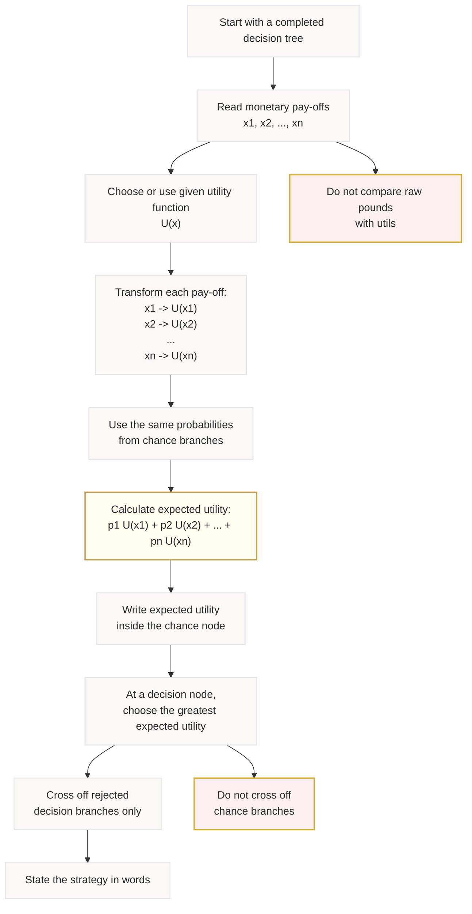

# Mermaid Asset: OffSpecDecisionAnalysisMermaid-005

## Asset metadata

| Field | Value |
|---|---|
| Asset ID | OffSpecDecisionAnalysisMermaid-005 |
| Source | `transcripts.md`, utility function theory and expected utility explanation |
| Related lesson section | Section 8; Section 11; Section 12 |
| Used placeholder | `[VISUAL PLACEHOLDER: OffSpecDecisionAnalysisMermaid-005 | Source: transcripts.md | Insert from mermaid/OffSpecDecisionAnalysisMermaid-005.md | Purpose: Show the workflow from monetary pay-offs to expected utility.]` |
| Purpose | Show how utility modifies the ordinary EMV workflow. |

## Mermaid code

