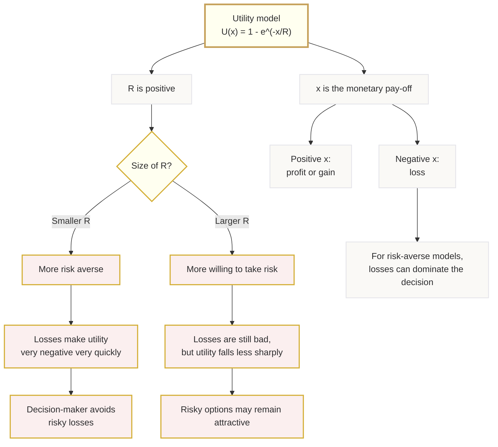

# Mermaid Asset: OffSpecDecisionAnalysisMermaid-006

## Asset metadata

| Field | Value |
|---|---|
| Asset ID | OffSpecDecisionAnalysisMermaid-006 |
| Source | `transcripts.md`, utility theory explanation of risk aversion and parameter R |
| Related lesson section | Section 8; Section 15 |
| Used placeholder | `[VISUAL PLACEHOLDER: OffSpecDecisionAnalysisMermaid-006 | Source: transcripts.md | Insert from mermaid/OffSpecDecisionAnalysisMermaid-006.md | Purpose: Summarise how the risk parameter R affects utility decisions.]` |
| Purpose | Explain the interpretation of R in utility modelling. |

## Mermaid code

