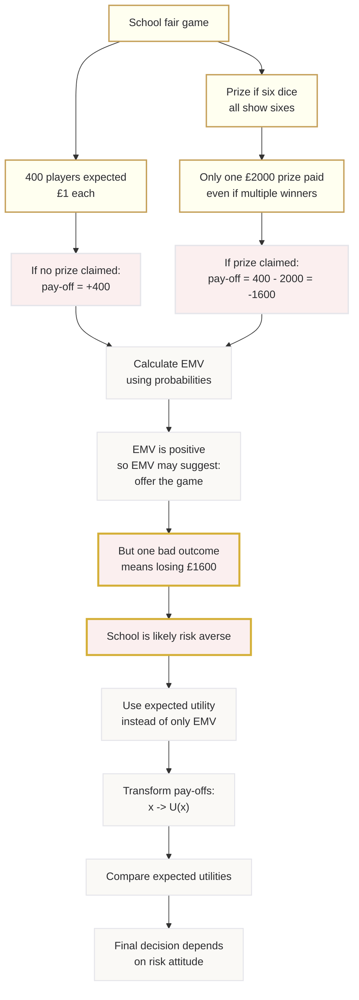

# Mermaid Asset: OffSpecDecisionAnalysisMermaid-007

## Asset metadata

| Field | Value |
|---|---|
| Asset ID | OffSpecDecisionAnalysisMermaid-007 |
| Source | `transcripts.md`, school fair EMV and utility motivation |
| Related lesson section | Section 8; Section 11 Worked Examples 3 and 4 |
| Used placeholder | `[VISUAL PLACEHOLDER: OffSpecDecisionAnalysisMermaid-007 | Source: transcripts.md | Insert from mermaid/OffSpecDecisionAnalysisMermaid-007.md | Purpose: Show why positive EMV does not always settle a risky decision.]` |
| Purpose | Explain why positive EMV may still be rejected by a risk-averse organisation. |

## Mermaid code

