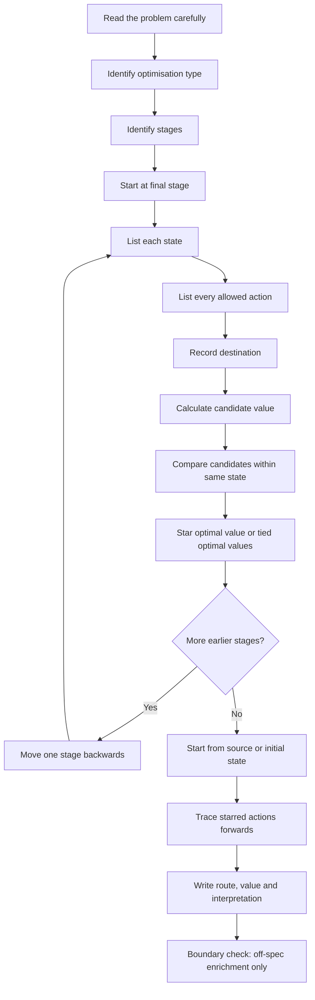

# Mermaid Asset: FA22DynamicProgrammingOffSpecEnrichmentMermaid-001

```mermaid
flowchart TD
    A[Read the problem carefully] --> B[Identify optimisation type]
    B --> C[Identify stages]
    C --> D[Start at final stage]
    D --> E[List each state]
    E --> F[List every allowed action]
    F --> G[Record destination]
    G --> H[Calculate candidate value]
    H --> I[Compare candidates within same state]
    I --> J[Star optimal value or tied optimal values]
    J --> K{More earlier stages?}
    K -- Yes --> L[Move one stage backwards]
    L --> E
    K -- No --> M[Start from source or initial state]
    M --> N[Trace starred actions forwards]
    N --> O[Write route, value and interpretation]
    O --> P[Boundary check: off-spec enrichment only]
```
