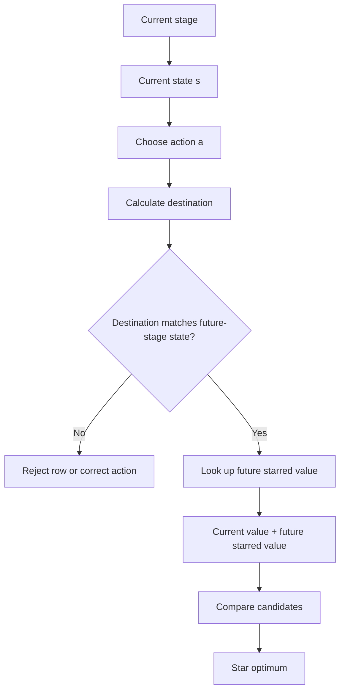

# Mermaid Asset: FA22DynamicProgrammingOffSpecEnrichmentMermaid-004

```mermaid
flowchart TD
    A[Current stage] --> B[Current state s]
    B --> C[Choose action a]
    C --> D[Calculate destination]
    D --> E{Destination matches future-stage state?}
    E -- No --> F[Reject row or correct action]
    E -- Yes --> G[Look up future starred value]
    G --> H[Current value + future starred value]
    H --> I[Compare candidates]
    I --> J[Star optimum]
```
