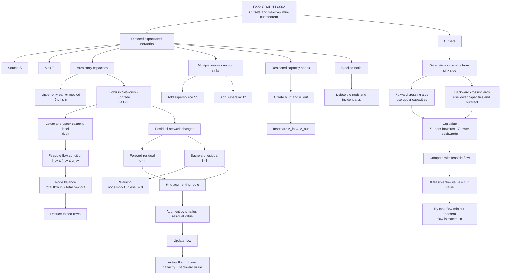

# FA22FlowsInNetworks2Mermaid-001

## Purpose

Show how **FA22-GRAPH-LO002** branches from cutsets and the max-flow min-cut theorem into the lesson-specific methods for **Flows in Networks 2**.

## Mermaid code

