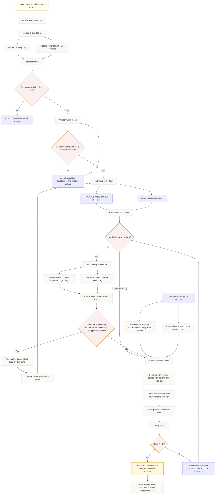

# FA22FlowsInNetworksMermaid-001

## Asset Metadata

| Field | Value |
|---|---|
| Asset ID | `FA22FlowsInNetworksMermaid-001` |
| Unit | `FA22` |
| Topic code | `FA22-GRAPH` |
| Topic ID | `FA22FlowsInNetworks` |
| Lesson file | `FA22_flows_in_networks_lesson.md` |
| Related lesson sections | Section 8 Core Theory; Section 9 Visual Asset Integration; Section 11 Worked Examples; Section 15 Exam Technique Notes |
| Used placeholder | `[VISUAL PLACEHOLDER: FA22FlowsInNetworksMermaid-001 | Source: CCEA FA22-GRAPH-LO002 + uploaded transcript | Insert from mermaid/FA22FlowsInNetworksMermaid-001.md | Purpose: Show the complete decision route from reading a capacitated directed network to proving maximality using the maximum flow-minimum cut theorem.]` |
| Source | CCEA `FA22-GRAPH-LO002` + uploaded transcript `Chapter 3: Flows in Networks 1` |
| Purpose | Show the complete workflow for solving a flows-in-networks problem. |
| Creation notes | Lesson-navigation diagram, not a replacement for a precise network diagram. |

## Mermaid Diagram

