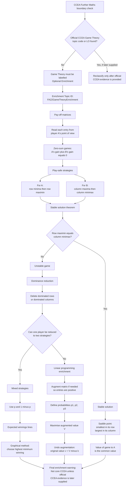

# Mermaid Asset: FA22GameTheoryEnrichmentMermaid-001

## Asset Metadata

| Field | Entry |
|---|---|
| Asset ID | `FA22GameTheoryEnrichmentMermaid-001` |
| Asset type | Mermaid flowchart |
| Lesson file | `FA22_game_theory_enrichment_lesson.md` |
| Related lesson section | `# 9. Visual Asset Integration` |
| Used placeholder | `[VISUAL PLACEHOLDER: FA22GameTheoryEnrichmentMermaid-001 | Source: CCEA boundary check + Decision 2 transcript evidence | Insert from mermaid/FA22GameTheoryEnrichmentMermaid-001.md | Purpose: Show that Game Theory is optional enrichment and map the learning flow from pay-off matrices to mixed strategies and linear programming.]` |
| Source | CCEA boundary check + Decision 2 transcript evidence |
| Core CCEA status | Optional enrichment only |
| Purpose | Show that Game Theory is not confirmed as official CCEA Further Mathematics content, then map the enrichment learning flow from pay-off matrices to mixed strategies and linear programming. |

## Mermaid Code

