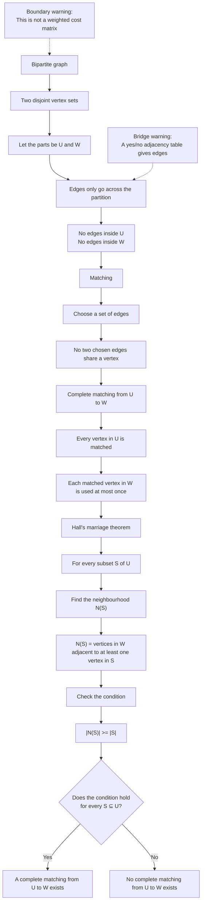

# Mermaid Asset: FA22GraphTheoryBipartiteMatchingsMermaid-001

## Asset Metadata

| Field | Value |
|---|---|
| Asset ID | `FA22GraphTheoryBipartiteMatchingsMermaid-001` |
| Topic ID | `FA22GraphTheoryBipartiteMatchings` |
| Unit | `FA22` |
| Topic code | `FA22-GRAPH` |
| Related lesson file | `FA22_graph_theory_bipartite_matchings_lesson.md` |
| Related lesson section | Section 9.1 Concept Flow Diagram |
| Used placeholder | `[VISUAL PLACEHOLDER: FA22GraphTheoryBipartiteMatchingsMermaid-001 | Source: CCEA FA22-GRAPH-LO003 and FA22-GRAPH-LO004 | Insert from mermaid/FA22GraphTheoryBipartiteMatchingsMermaid-001.md | Purpose: Show the logical flow from bipartite graph to matching to complete matching to Hall’s marriage theorem.]` |
| Source | CCEA FA22-GRAPH-LO003 and FA22-GRAPH-LO004 |
| Evidence status | Core CCEA Further Mathematics content |
| Purpose | Show the logical flow from bipartite graph to matching to complete matching to Hall’s marriage theorem. |
| Bridge role | Connects ordinary table/mapping thinking to Further Maths graph-theoretic matching conditions. |
| Off-spec guard | Does not include Hungarian algorithm, cost matrices, dummy entries, maximum allocation or weighted assignment methods. |

## Creation Notes

This diagram is a conceptual flowchart for the CCEA core lesson. It deliberately follows the syllabus-safe route:

1. Bipartite graph
2. Two disjoint vertex sets
3. Edges only across the partition
4. Matching
5. No shared vertices
6. Complete matching
7. Every vertex in \(U\) is matched
8. Hall’s marriage theorem
9. For every \(S\subseteq U\), \(|N(S)|\ge |S|\)

The uploaded D2 allocation evidence discusses weighted allocation and the Hungarian algorithm, but that content is excluded from this Mermaid diagram because it was logged as off-spec enrichment for this CCEA FA22 Graph theory lesson.

## Mermaid Code

## Student Reading Notes

Read this diagram from top to bottom.

The key turning point is the movement from a **matching** to a **complete matching**:

- A matching only needs no repeated vertices.
- A complete matching from \(U\) to \(W\) must match every vertex in \(U\).

Hall’s theorem then gives the existence test:

\[
|N(S)|\ge |S|
\]

for every subset:

\[
S\subseteq U.
\]

If even one subset has too few neighbours, the complete matching is impossible.
