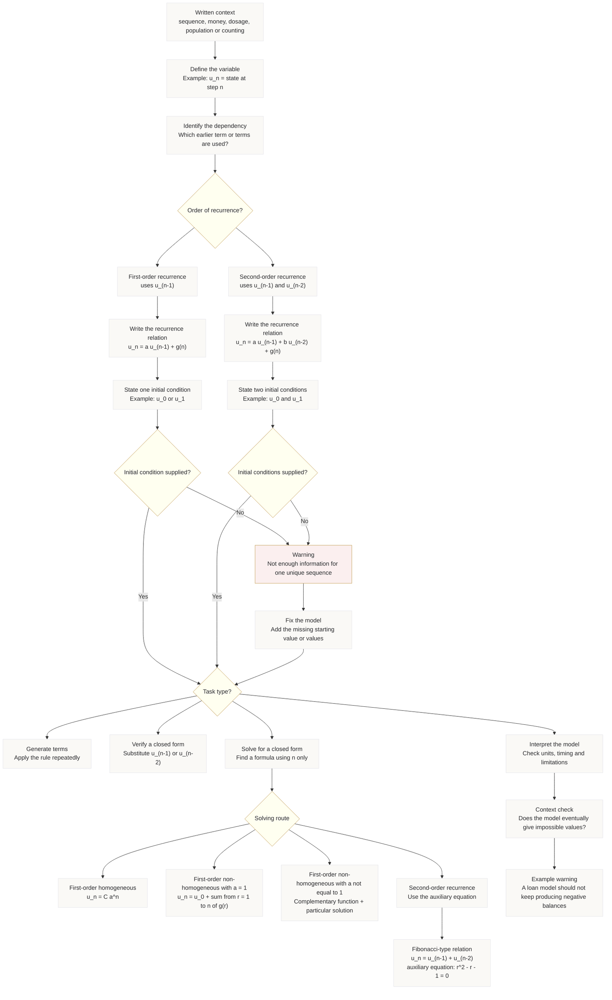

# FAS2RecurrenceRelationshipsMermaid-001

## Asset ID

`FAS2RecurrenceRelationshipsMermaid-001`

## Source

- CCEA FAS2-REC specification boundary.
- Uploaded recurrence relations transcript.
- Phase 1 lesson placeholder from Section 9.2.

## Related lesson section

`# 9. Visual Asset Integration`

## Used placeholder

```text
[VISUAL PLACEHOLDER: FAS2RecurrenceRelationshipsMermaid-001 | Source: CCEA FAS2-REC specification boundary + uploaded recurrence transcript | Insert from mermaid/FAS2RecurrenceRelationshipsMermaid-001.md | Purpose: Show the full recurrence workflow: define variable, identify previous-term dependence, write recurrence relation, add initial conditions, generate terms, verify or solve for closed form.]
```

## Purpose

Show the complete recurrence workflow:

1. begin with a written context;
2. define the variable;
3. identify whether the recurrence is first-order or second-order;
4. write the recurrence relation;
5. add the required initial condition or initial conditions;
6. choose whether to generate, verify, solve or interpret;
7. warn that missing initial conditions mean the recurrence does not define one unique sequence.

## Creation notes

This diagram is designed as the student’s “recurrence control panel”. It keeps the modelling workflow separate from the solving workflow, then joins them at the decision point where the student chooses the task type.

The missing-initial-condition branch is deliberately shown as a red warning route, because the transcript repeatedly treats initial conditions as essential for generating the sequence or modelling context.

## Mermaid code



## Accessibility notes

- The diagram avoids colour-only meaning by using explicit text labels such as “Warning” and “Task type”.
- The missing-initial-condition path is labelled in words, not just colour.
- The notation uses plain text inside Mermaid labels to reduce rendering errors.

## Lesson integration note

Insert this asset at Section 9.2 of `FAS2_recurrence_relationships_lesson.md`.
