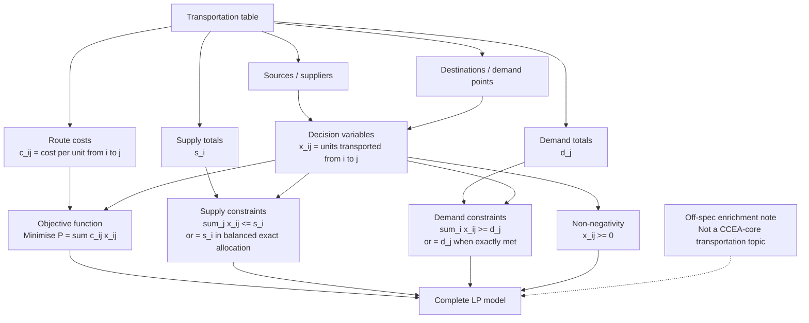

# Mermaid Asset: OffSpecTransportationProblemsEnrichmentMermaid-001

| Field | Value |
|---|---|
| Asset ID | `OffSpecTransportationProblemsEnrichmentMermaid-001` |
| Asset type | Mermaid flowchart |
| Lesson file | `offspec_transportation_problems_enrichment_lesson.md` |
| Related lesson section | Section 9.9 Linear Programming Formulation Map; Section 11 Worked Example 8 |
| Source | Teacher transcript: Transportation Problems 8, Linear programming |
| CCEA status | Off-spec enrichment only |
| Purpose | Show how a transportation table becomes a linear programming formulation. |

## Accessibility Description

A vertical flowchart starts with the transportation table. It branches into sources, destinations, route costs, supply totals and demand totals. Sources and destinations define route variables. Route costs and variables create the objective function. Supply totals create supply constraints. Demand totals create demand constraints. Non-negativity constraints apply to every variable. These combine into the LP model.
