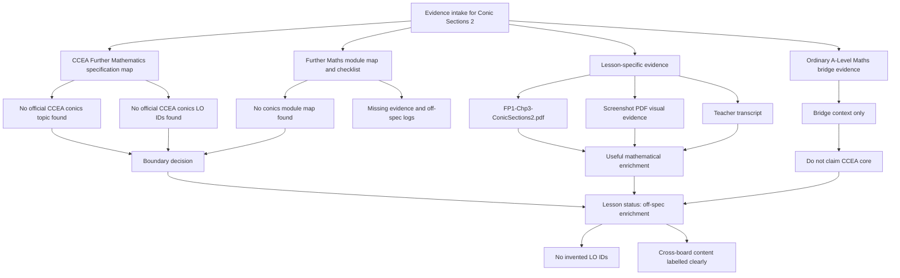

# Mermaid Asset: FA21ConicSections2EnrichmentMermaid-001

## Asset Metadata

| Field | Value |
|---|---|
| Asset ID | `FA21ConicSections2EnrichmentMermaid-001` |
| Type | Mermaid flowchart |
| Source | CCEA Further Mathematics boundary check + uploaded Conics 2 evidence |
| Related lesson sections | Sections 2, 3, 16 |
| Purpose | Show why the conics material is treated as off-spec enrichment rather than confirmed CCEA core. |
| Boundary status | Off-spec enrichment until official CCEA conics evidence is supplied. |

## Mermaid Code

