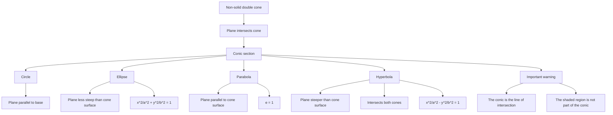

# Mermaid Asset: FA21ConicSections2EnrichmentMermaid-002

## Asset Metadata

| Field | Value |
|---|---|
| Asset ID | `FA21ConicSections2EnrichmentMermaid-002` |
| Type | Mermaid classification chart |
| Source | DrFrost/Pearson Conics 2 recap + screenshot visual evidence |
| Related lesson sections | Sections 6, 8.1, 9 |
| Purpose | Map the double-cone slicing idea into circle, ellipse, parabola and hyperbola. |
| Boundary status | Off-spec enrichment until official CCEA conics evidence is supplied. |

## Mermaid Code

