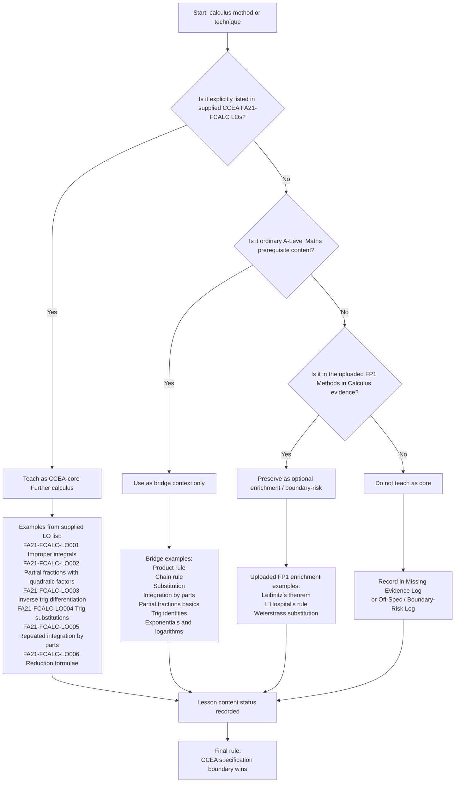

# FA21FurtherCalculusMermaid-001

## Asset metadata

| Field | Value |
|---|---|
| Asset ID | `FA21FurtherCalculusMermaid-001` |
| Asset type | Mermaid diagram |
| Related lesson file | `FA21_further_calculus_lesson.md` |
| Related lesson section | Section 9.2 Boundary decision flow |
| Used placeholder | `[VISUAL PLACEHOLDER: FA21FurtherCalculusMermaid-001 | Source: CCEA Further Mathematics specification map + uploaded FP1 Methods in Calculus evidence | Insert from mermaid/FA21FurtherCalculusMermaid-001.md | Purpose: Decide whether a method is CCEA-core, boundary-risk, bridge-only or optional enrichment.]` |
| Source | CCEA Further Mathematics specification map + uploaded FP1 Methods in Calculus PDF/transcript |
| Purpose | Decide whether a method belongs in CCEA-core Further calculus, bridge context, optional enrichment, or the missing evidence log. |
| Boundary note | Leibnitz’s theorem, L’Hospital’s rule and Weierstrass substitution are treated as enrichment / boundary-risk content because they were present in uploaded FP1 evidence but not explicitly confirmed in the supplied CCEA `FA21-FCALC` LO list. |

## Creation notes

This diagram is a syllabus-boundary guardrail. It is designed to stop a student from importing a cross-board method into the CCEA-core lesson merely because it appears in the uploaded lesson evidence.

## Mermaid code

## Accessibility text description

This flowchart begins with a calculus method or technique and asks whether it is explicitly listed in the supplied CCEA `FA21-FCALC` learning outcomes. If it is, it is taught as CCEA-core Further calculus. If not, the diagram checks whether it is ordinary A-Level Mathematics prerequisite content, in which case it becomes bridge context only. If it is not bridge content, the diagram checks whether it appears in the uploaded FP1 Methods in Calculus evidence. If so, it is preserved as optional enrichment or boundary-risk content. If not, it is not taught as core and is logged as missing or off-spec evidence. The final rule is that the CCEA specification boundary wins.
