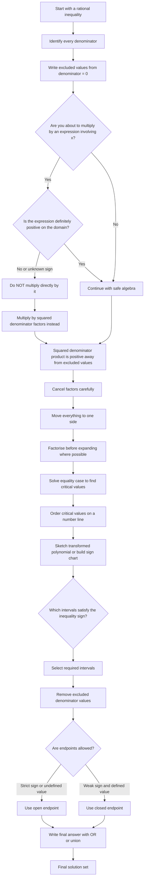

# FA21InequalitiesMermaid-001

## Asset Metadata

| Field | Entry |
|---|---|
| Asset ID | FA21InequalitiesMermaid-001 |
| Asset type | Mermaid flowchart |
| Lesson file | FA21_inequalities_lesson.md |
| Related lesson section | Section 9.1 Mermaid assets; Section 8.2 The denominator-squared method; Section 11 Worked Examples 1–4 |
| Used placeholder | `[VISUAL PLACEHOLDER: FA21InequalitiesMermaid-001 | Source: FP1 inequalities transcript + PDF enrichment evidence | Insert from mermaid/FA21InequalitiesMermaid-001.md | Purpose: Flowchart for solving rational inequalities algebraically: identify exclusions, multiply by denominator squares, rearrange, factorise, find critical values, sketch, remove undefined values, write solution.]` |
| Source | FP1 inequalities transcript + PDF enrichment evidence |
| Boundary status | Internal portal enrichment, not official CCEA Further Mathematics specification content |
| Purpose | Show the safe algebraic workflow for rational inequalities, especially the denominator-squared method. |

## Mermaid Code

