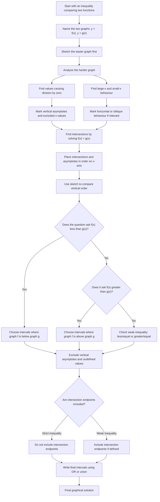

# FA21InequalitiesMermaid-002

## Asset Metadata

| Field | Entry |
|---|---|
| Asset ID | FA21InequalitiesMermaid-002 |
| Asset type | Mermaid flowchart |
| Lesson file | FA21_inequalities_lesson.md |
| Related lesson section | Section 9.1 Mermaid assets; Section 8.7 Graphical inequalities; Section 11 Worked Examples 5–6 |
| Used placeholder | `[VISUAL PLACEHOLDER: FA21InequalitiesMermaid-002 | Source: FP1 inequalities transcript + PDF enrichment evidence | Insert from mermaid/FA21InequalitiesMermaid-002.md | Purpose: Flowchart for graphical inequalities: sketch both graphs, find asymptotes, find intersections, compare vertical order, write intervals.]` |
| Source | FP1 inequalities transcript + PDF enrichment evidence |
| Boundary status | Internal portal enrichment, not official CCEA Further Mathematics specification content |
| Purpose | Show how to solve graphical inequalities using sketches, intersections, asymptotes and vertical order. |

## Mermaid Code

