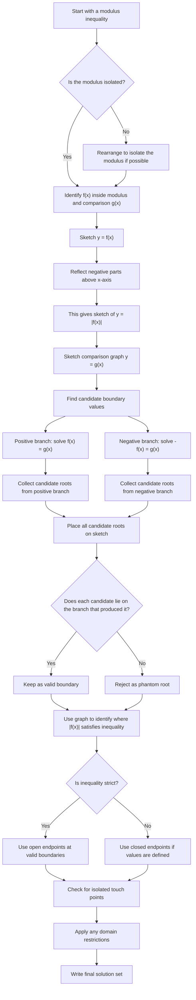

# FA21InequalitiesMermaid-003

## Asset Metadata

| Field | Entry |
|---|---|
| Asset ID | FA21InequalitiesMermaid-003 |
| Asset type | Mermaid flowchart |
| Lesson file | FA21_inequalities_lesson.md |
| Related lesson section | Section 9.1 Mermaid assets; Section 8.8–8.10 Modulus inequalities; Section 11 Worked Examples 10–18 |
| Used placeholder | `[VISUAL PLACEHOLDER: FA21InequalitiesMermaid-003 | Source: FP1 modulus inequalities transcript + PDF enrichment evidence | Insert from mermaid/FA21InequalitiesMermaid-003.md | Purpose: Flowchart for modulus inequalities: sketch |f(x)|, solve positive branch, solve negative branch, reject phantom roots, write solution.]` |
| Source | FP1 modulus inequalities transcript + PDF enrichment evidence |
| Boundary status | Internal portal enrichment, not official CCEA Further Mathematics specification content |
| Purpose | Show how modulus inequalities are solved by sketching, branch equations and validity checks. |

## Mermaid Code

