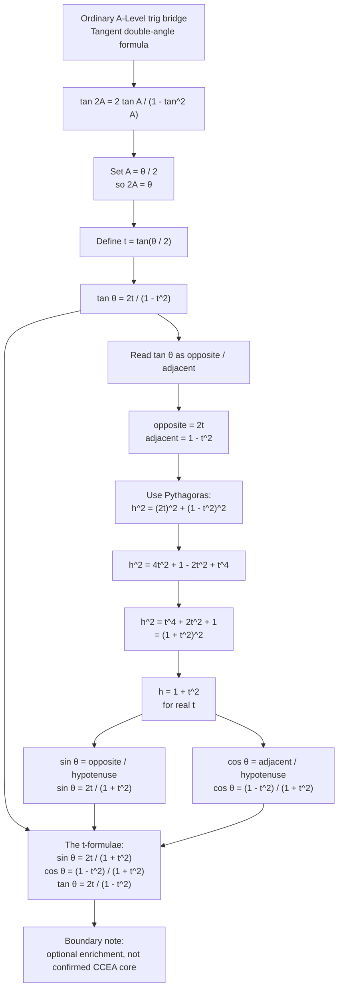

# FA21TFormulaeBoundaryEnrichmentMermaid-001

## Asset metadata

| Field | Value |
|---|---|
| Asset ID | `FA21TFormulaeBoundaryEnrichmentMermaid-001` |
| Asset type | Mermaid flowchart |
| Topic ID | `FA21TFormulaeBoundaryEnrichment` |
| Related lesson file | `FA21_t_formulae_boundary_enrichment_lesson.md` |
| Related lesson section | Section 9: Visual Asset Integration |
| Source | Supplied FP1 t-formulae PDF, screenshot derivation pages, teacher transcript |
| CCEA status | Not confirmed CCEA core; enrichment only |
| Purpose | Show how ordinary double-angle trigonometry grows into the t-formulae. |

