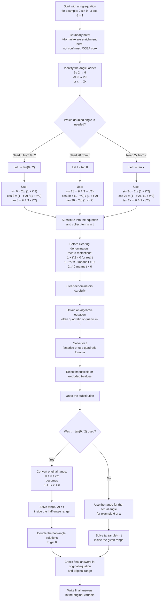

# FA21TFormulaeBoundaryEnrichmentMermaid-002

## Asset metadata

| Field | Value |
|---|---|
| Asset ID | `FA21TFormulaeBoundaryEnrichmentMermaid-002` |
| Asset type | Mermaid flowchart |
| Topic ID | `FA21TFormulaeBoundaryEnrichment` |
| Related lesson file | `FA21_t_formulae_boundary_enrichment_lesson.md` |
| Related lesson section | Section 9: Visual Asset Integration |
| Source | Supplied FP1 t-formulae PDF and teacher transcript |
| CCEA status | Not confirmed CCEA core; enrichment only |
| Purpose | Show the complete method for solving trigonometric equations using t-formulae. |

