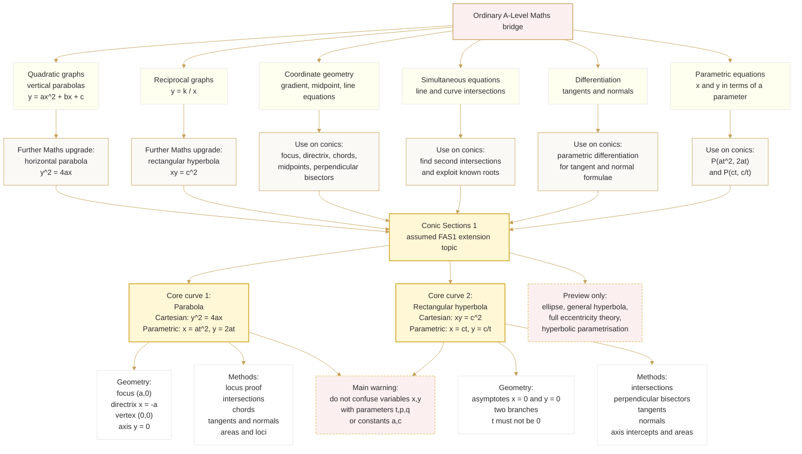

# FAS1ConicSections1Mermaid-001

## Asset Metadata

| Field | Value |
|---|---|
| Asset ID | `FAS1ConicSections1Mermaid-001` |
| Asset type | Mermaid flowchart |
| Topic ID | `FAS1ConicSections1` |
| Lesson file | `FAS1_conic_sections_1_lesson.md` |
| Related lesson sections | Section 5; Section 6; Section 8; Section 9 |
| Used placeholder | `[VISUAL PLACEHOLDER: FAS1ConicSections1Mermaid-001 | Source: Ordinary A-Level Maths bridge + Conics 1 evidence | Insert from mermaid/FAS1ConicSections1Mermaid-001.md | Purpose: Show how ordinary quadratics, reciprocal graphs, coordinate geometry, differentiation and parametric equations flow into Conic Sections 1. Description: A flowchart beginning with ordinary A-Level Maths skills and ending with parabola \(y^2=4ax\), rectangular hyperbola \(xy=c^2\), tangents, normals and loci.]` |
| Source | Ordinary CCEA A-Level Mathematics bridge context + `FP1-Chp2-ConicSections1.pdf` + `transcripts.md` |
| Source status | Cross-board Conics 1 evidence used as core under user override; ordinary A-Level Mathematics used as bridge context only |
| Purpose | Show how ordinary A-Level Mathematics ideas grow into the Conic Sections 1 methods used in this assumed FAS1 extension lesson. |

## Creation Notes

This diagram is a bridge map. It should help a first-time Further Mathematics student see that Conic Sections 1 grows from ordinary quadratic graphs, reciprocal graphs, coordinate geometry, simultaneous equations, differentiation and parametric equations.

## Mermaid Code

