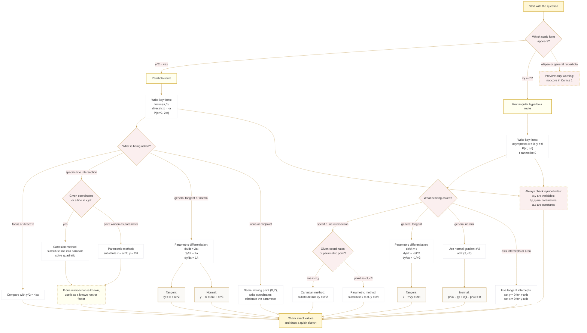

# FAS1ConicSections1Mermaid-002

## Asset Metadata

| Field | Value |
|---|---|
| Asset ID | `FAS1ConicSections1Mermaid-002` |
| Asset type | Mermaid decision tree |
| Topic ID | `FAS1ConicSections1` |
| Lesson file | `FAS1_conic_sections_1_lesson.md` |
| Related lesson sections | Section 8; Section 11; Section 12; Section 15 |
| Used placeholder | `[VISUAL PLACEHOLDER: FAS1ConicSections1Mermaid-002 | Source: FP1-Chp2-ConicSections1.pdf and transcripts.md | Insert from mermaid/FAS1ConicSections1Mermaid-002.md | Purpose: Help students choose between Cartesian and parametric methods. Description: A decision tree asking whether a point is given as \((at^2,2at)\) or \((ct,c/t)\), whether a line/axis condition is given, whether a tangent/normal is required, and whether elimination or substitution is cleaner.]` |
| Source | `FP1-Chp2-ConicSections1.pdf` + `transcripts.md` |
| Source status | Cross-board Conics 1 evidence used as core under user override |
| Purpose | Help students choose a clean method when solving parabola and rectangular hyperbola problems. |

## Creation Notes

This decision tree supports exam technique. It reflects the repeated lesson pattern: identify the conic, choose Cartesian or parametric form, use coordinate geometry for specific points and lines, use parametric differentiation for general tangents/normals, and keep preview-only material out of Conics 1 core work.

## Mermaid Code

