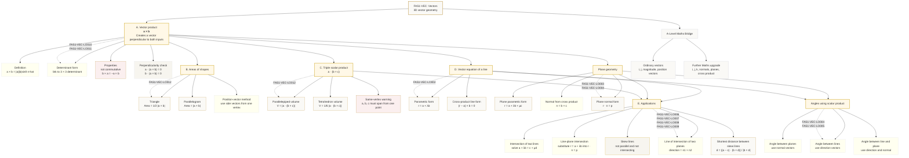

# FAS1VectorsMermaid-001

## Purpose

Show how **FAS1-VEC: Vectors** grows from the vector product into the main CCEA Further Mathematics vector tools.

```mermaid
flowchart TD
    Start["FAS1-VEC: Vectors<br/>3D vector geometry"]:::root
    A["A. Vector product<br/><b>a × b</b><br/>Creates a vector perpendicular to both inputs"]:::gold
    A1["Definition<br/>a × b = |a||b|sinθ n-hat"]:::method
    A2["Determinant form<br/>link to 3 × 3 determinant"]:::method
    A3["Properties<br/>not commutative<br/>b × a = −a × b"]:::warning
    A4["Perpendicularity check<br/>a · (a × b) = 0<br/>b · (a × b) = 0"]:::check
    B["B. Areas of shapes"]:::gold
    B1["Triangle<br/>Area = 1/2 |a × b|"]:::formula
    B2["Parallelogram<br/>Area = |a × b|"]:::formula
    B3["Position-vector method<br/>use side vectors from one vertex"]:::method
    C["C. Triple scalar product<br/>a · (b × c)"]:::gold
    C1["Parallelepiped volume<br/>V = |a · (b × c)|"]:::formula
    C2["Tetrahedron volume<br/>V = 1/6 |a · (b × c)|"]:::formula
    C3["Same-vertex warning<br/>a, b, c must span from one point"]:::warning
    D["D. Vector equation of a line"]:::gold
    D1["Parametric form<br/>r = a + λb"]:::formula
    D2["Cross-product line form<br/>(r − a) × b = 0"]:::formula
    P["Plane geometry"]:::gold
    P1["Plane parametric form<br/>r = a + λb + μc"]:::formula
    P2["Normal from cross product<br/>n = b × c"]:::method
    P3["Plane normal form<br/>r · n = p"]:::formula
    E["E. Applications"]:::gold
    E1["Intersection of two lines<br/>solve a + λb = c + μd"]:::method
    E2["Line-plane intersection<br/>substitute r = a + λb into r · n = p"]:::method
    E3["Line of intersection of two planes<br/>direction = n1 × n2"]:::method
    E4["Skew lines<br/>not parallel and not intersecting"]:::definition
    E5["Shortest distance between skew lines<br/>d = |(a − c) · (b × d)| / |b × d|"]:::formula
    Angle["Angles using scalar product"]:::gold
    Angle1["Angle between lines<br/>use direction vectors"]:::method
    Angle2["Angle between planes<br/>use normal vectors"]:::method
    Angle3["Angle between line and plane<br/>use direction and normal"]:::method
    Bridge["A-Level Maths Bridge"]:::bridge
    Bridge1["Ordinary vectors<br/>i, j, magnitude, position vectors"]:::bridge
    Bridge2["Further Maths upgrade<br/>i, j, k, normals, planes, cross product"]:::bridge
    Start --> Bridge
    Bridge --> Bridge1
    Bridge --> Bridge2
    Start --> A
    A --> A1
    A --> A2
    A --> A3
    A --> A4
    A --> B
    B --> B1
    B --> B2
    B --> B3
    A --> C
    C --> C1
    C --> C2
    C --> C3
    A --> D
    D --> D1
    D --> D2
    A --> P
    P --> P1
    P --> P2
    P --> P3
    D --> E
    P --> E
    C --> E
    E --> E1
    E --> E2
    E --> E3
    E --> E4
    E --> E5
    P --> Angle
    D --> Angle
    Angle --> Angle1
    Angle --> Angle2
    Angle --> Angle3
    A -. "FAS1-VEC-LO010<br/>FAS1-VEC-LO011" .-> A2
    B -. "FAS1-VEC-LO012" .-> B1
    C -. "FAS1-VEC-LO012" .-> C1
    D -. "FAS1-VEC-LO002" .-> D1
    P -. "FAS1-VEC-LO003<br/>FAS1-VEC-LO004" .-> P3
    E -. "FAS1-VEC-LO006<br/>FAS1-VEC-LO007<br/>FAS1-VEC-LO008<br/>FAS1-VEC-LO009" .-> E3
    Angle -. "FAS1-VEC-LO004<br/>FAS1-VEC-LO005" .-> Angle1
    classDef root fill:#FAF9F6,stroke:#C5A059,stroke-width:2px,color:#2C2C2E;
    classDef gold fill:#FFF8E7,stroke:#D4AF37,stroke-width:2px,color:#2C2C2E;
    classDef method fill:#FFFFF0,stroke:#E5E5EA,stroke-width:1px,color:#2C2C2E;
    classDef formula fill:#FAF9F6,stroke:#C5A059,stroke-width:1px,color:#2C2C2E;
    classDef warning fill:#FBEFEF,stroke:#C5A059,stroke-width:1px,color:#2C2C2E;
    classDef check fill:#F7F5EF,stroke:#E5E5EA,stroke-width:1px,color:#2C2C2E;
    classDef definition fill:#F7F5EF,stroke:#D4AF37,stroke-width:1px,color:#2C2C2E;
    classDef bridge fill:#FAF9F6,stroke:#E5E5EA,stroke-width:2px,color:#2C2C2E;
```
