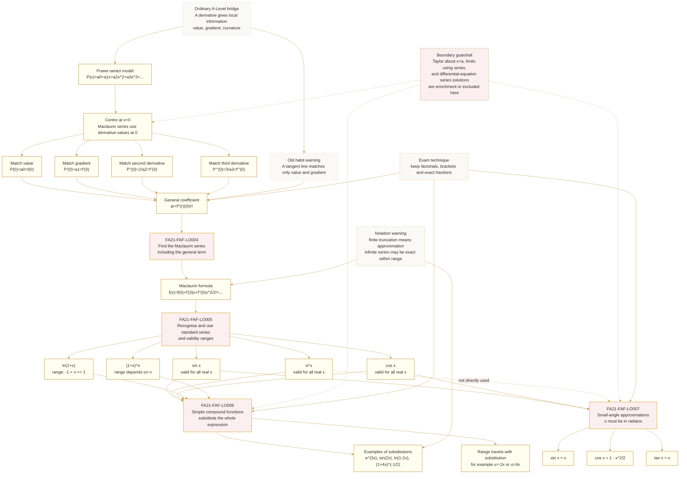

# FA21MaclaurinSeriesMermaid-001

## Asset Metadata

| Field | Value |
|---|---|
| Asset ID | `FA21MaclaurinSeriesMermaid-001` |
| Asset type | Mermaid diagram |
| Topic ID | `FA21MaclaurinSeries` |
| Unit | `FA21` - Further A2 1 Pure Mathematics |
| Topic code | `FA21-FAF` |
| Topic name | Further algebra and functions - Maclaurin series |
| Related lesson file | `FA21_maclaurin_series_lesson.md` |
| Related lesson section | Section 9.1 Mermaid learning path |
| Used placeholder | `[VISUAL PLACEHOLDER: FA21MaclaurinSeriesMermaid-001 | Source: CCEA \`FA21-FAF\` LO map + lesson boundary | Insert from mermaid/FA21MaclaurinSeriesMermaid-001.md | Purpose: Show the learning route from ordinary derivatives to Maclaurin coefficients, standard series, compound expansions and small-angle approximations. The diagram must show the chain \`derivatives at x=0 → coefficients → standard series → substitutions → approximations\`, with \`FA21-FAF-LO004\` to \`FA21-FAF-LO007\` attached to the relevant nodes.]` |
| Source | CCEA `FA21-FAF` LO map + Phase 1 lesson boundary + Maclaurin derivative-matching evidence |
| Purpose | Show the learning route from ordinary derivatives to Maclaurin coefficients, standard series, compound expansions and small-angle approximations. |
| Evidence status | Syllabus-backed and evidence-inspired. The Taylor-series boundary node is included only as a warning/enrichment marker, not as CCEA core teaching content. |

## Creation Notes

This diagram is designed as a student-facing route map for the whole lesson.

It shows the sequence:

\[
\text{ordinary derivative idea}
\rightarrow
\text{power series}
\rightarrow
\text{derivatives at }x=0
\rightarrow
\text{Maclaurin coefficient formula}
\rightarrow
\text{standard series}
\rightarrow
\text{compound expansions}
\rightarrow
\text{small-angle approximations}.
\]

The diagram attaches each CCEA learning outcome to the relevant stage:

- `FA21-FAF-LO004`: finding Maclaurin series, including the general term;
- `FA21-FAF-LO005`: recognising and using standard Maclaurin series and validity ranges;
- `FA21-FAF-LO006`: deriving simple compound expansions;
- `FA21-FAF-LO007`: using small-angle approximations in radians.

The boundary guardrail node is included because the lesson-specific evidence is a wider cross-board Taylor chapter. It reminds the student that Taylor expansions about \(x=a\), limits using Taylor/Maclaurin series and differential-equation series solutions are enrichment or excluded from the CCEA core lesson unless separately specified.

## Mermaid Code

## Accessibility Notes

The diagram should be read from top to bottom.

The main CCEA core route is:

1. ordinary derivative idea;
2. power-series model;
3. matching derivatives at \(x=0\);
4. coefficient formula;
5. standard Maclaurin series;
6. compound functions;
7. small-angle approximations.

Dashed nodes are warnings or boundary notes, not extra core content.

## Asset Status

Generated in chat for Phase 2.
