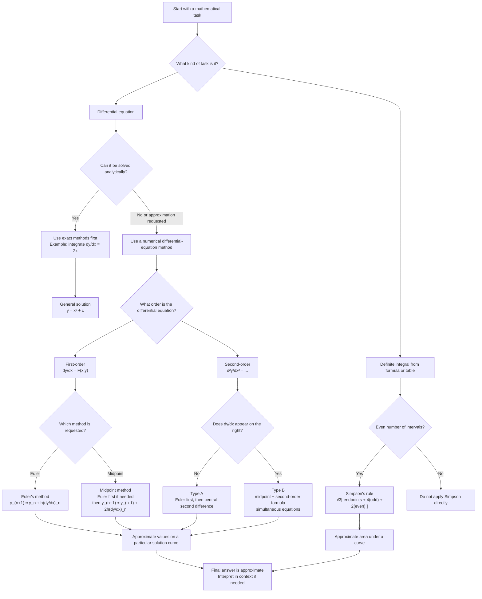

# OffSpecNumericalMethodsMermaid-001

## Purpose

Show when a student should solve analytically and when a numerical method becomes useful.

```mermaid
flowchart TD
    A["Start with a mathematical task"] --> B{"What kind of task is it?"}
    B --> C["Differential equation"]
    B --> D["Definite integral from formula or table"]
    C --> E{"Can it be solved analytically?"}
    E -->|Yes| F["Use exact methods first<br/>Example: integrate dy/dx = 2x"]
    F --> G["General solution<br/>y = x² + c"]
    E -->|No or approximation requested| H["Use a numerical differential-equation method"]
    H --> I{"What order is the differential equation?"}
    I --> J["First-order<br/>dy/dx = F(x,y)"]
    J --> K{"Which method is requested?"}
    K -->|Euler| L["Euler's method<br/>y_(n+1) ≈ y_n + h(dy/dx)_n"]
    K -->|Midpoint| M["Midpoint method<br/>Euler first if needed<br/>then y_(n+1) ≈ y_(n-1) + 2h(dy/dx)_n"]
    I --> N["Second-order<br/>d²y/dx² = ..."]
    N --> O{"Does dy/dx appear on the right?"}
    O -->|No| P["Type A<br/>Euler first, then central second difference"]
    O -->|Yes| Q["Type B<br/>midpoint + second-order formula<br/>simultaneous equations"]
    D --> R{"Even number of intervals?"}
    R -->|Yes| S["Simpson's rule<br/>h/3[ endpoints + 4(odd) + 2(even) ]"]
    R -->|No| T["Do not apply Simpson directly"]
    L --> U["Approximate values on a particular solution curve"]
    M --> U
    P --> U
    Q --> U
    S --> V["Approximate area under a curve"]
    U --> W["Final answer is approximate<br/>Interpret in context if needed"]
    V --> W
```
