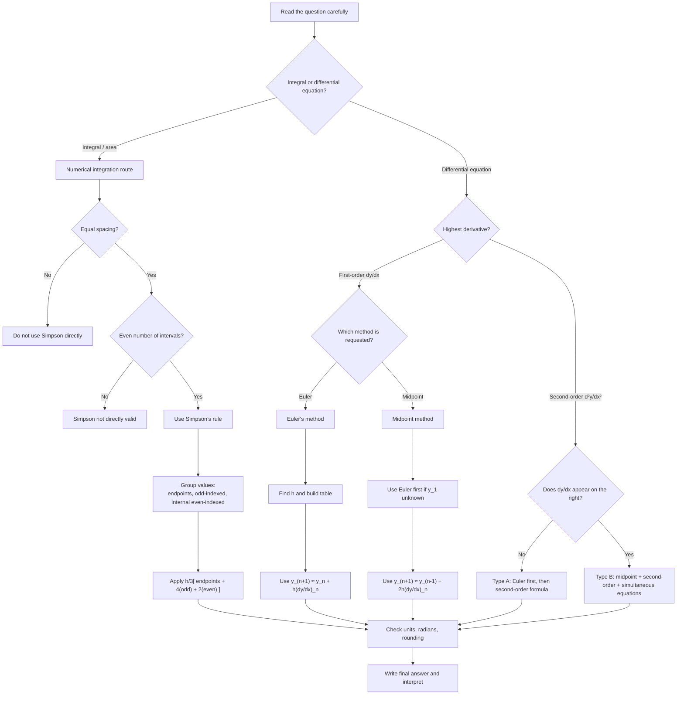

# OffSpecNumericalMethodsMermaid-002

## Purpose

Help students choose the right enrichment method and avoid mixing formulae.

```mermaid
flowchart TD
    A["Read the question carefully"] --> B{"Integral or differential equation?"}
    B -->|Integral / area| C["Numerical integration route"]
    C --> D{"Equal spacing?"}
    D -->|No| E["Do not use Simpson directly"]
    D -->|Yes| F{"Even number of intervals?"}
    F -->|No| G["Simpson not directly valid"]
    F -->|Yes| H["Use Simpson's rule"]
    H --> I["Group values:<br/>endpoints, odd-indexed, internal even-indexed"]
    I --> J["Apply h/3[ endpoints + 4(odd) + 2(even) ]"]
    B -->|Differential equation| K{"Highest derivative?"}
    K -->|First-order dy/dx| L{"Which method is requested?"}
    L -->|Euler| M["Euler's method"]
    M --> N["Find h and build table"]
    N --> O["Use y_(n+1) ≈ y_n + h(dy/dx)_n"]
    L -->|Midpoint| P["Midpoint method"]
    P --> Q["Use Euler first if y_1 unknown"]
    Q --> R["Use y_(n+1) ≈ y_(n-1) + 2h(dy/dx)_n"]
    K -->|Second-order d²y/dx²| S{"Does dy/dx appear on the right?"}
    S -->|No| T["Type A: Euler first, then second-order formula"]
    S -->|Yes| U["Type B: midpoint + second-order + simultaneous equations"]
    O --> V["Check units, radians, rounding"]
    R --> V
    T --> V
    U --> V
    J --> V
    V --> W["Write final answer and interpret"]
```
